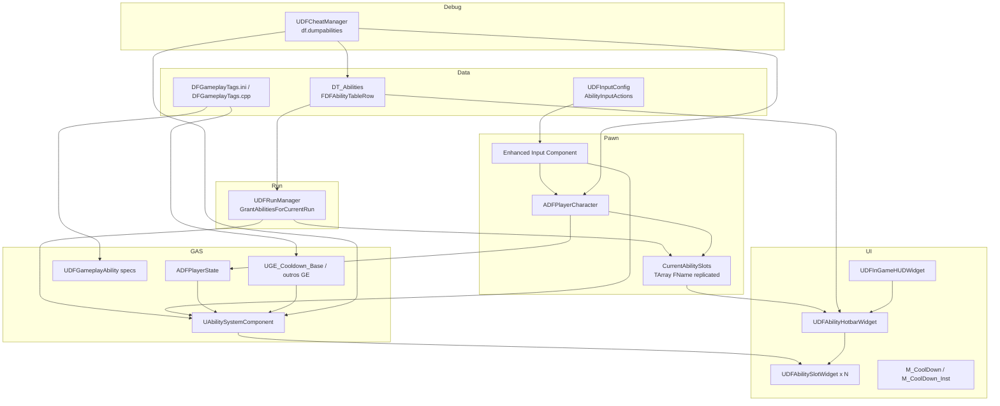

# Barra de habilidades, GAS, input e cooldowns

Documentação de referência do sistema de **hotbar**, **ativação por input**, **layout de slots** (`CurrentAbilitySlots`), **cooldown na UI** e **debug**. Inclui o estado **atual** do código (UE 5.4), integrações entre módulos, lacunas conhecidas e o **alvo** estilo World of Warcraft (barra 1–12, LMB/RMB fixos, drag-and-drop).

**Última revisão:** 2026-05-15  
**Engine:** Unreal Engine 5.4  
**Escopo:** runtime C++ + assets UMG/GAS referenciados no repositório.

---

## Índice

1. [Visão geral](#1-visão-geral)
2. [Mapa de integrações](#2-mapa-de-integrações)
3. [Fluxo de dados (runtime)](#3-fluxo-de-dados-runtime)
4. [Classes e ficheiros C++](#4-classes-e-ficheiros-c)
5. [Dados: `FDFAbilityTableRow` e `DT_Abilities`](#5-dados-fdfabilitytablerow-e-dt_abilities)
6. [Input e GAS (`InputID`)](#6-input-e-gas-inputid)
7. [UI: hotbar e slot](#7-ui-hotbar-e-slot)
8. [Cooldowns (GameplayEffect + HUD)](#8-cooldowns-gameplayeffect--hud)
9. [Comparação com o projeto Aura](#9-comparação-com-o-projeto-aura)
10. [Debug: `df.dumpabilities`](#10-debug-dfdumpabilities)
11. [Lacunas e inconsistências atuais](#11-lacunas-e-inconsistências-atuais)
12. [Alvo: WoW 1–12, LMB/RMB, drag-and-drop](#12-alvo-wow-112-lmbrmb-drag-and-drop)
13. [Checklist de assets e configuração](#13-checklist-de-assets-e-configuração)
14. [Referências externas](#14-referências-externas)

---

## 1. Visão geral

O jogador possui:

| Camada | Responsabilidade |
|--------|------------------|
| **ASC** (`ADFPlayerState::AbilitySystemComponent`) | Specs de `UGameplayAbility`, efeitos activos, cooldowns via GE |
| **Layout da barra** (`ADFPlayerCharacter::CurrentAbilitySlots`) | Qual **row** do `DT_Abilities` aparece em cada índice de slot (replicado) |
| **Input** | Enhanced Input → activação (tags, `InputID`, combo, movimento) |
| **HUD** | `UDFAbilityHotbarWidget` + `UDFAbilitySlotWidget` — ícone, label, overlay de CD |

Hoje a barra está pensada para **até 8 widgets** na UI, mas o **estado replicado** inicia com **4** entradas. O ataque básico (**LMB**) e movimentos como **Sprint** não dependem da mesma lógica que os slots numerados.

---

## 2. Mapa de integrações



### Tabela de dependências

| De | Para | Contrato |
|----|------|----------|
| `UDFRunManager` | `ASC` | `GiveAbility(FGameplayAbilitySpec)` com `InputID` |
| `UDFRunManager` | `CurrentAbilitySlots` | Preenche índice UI com **nome da row** |
| `UDFAbilityHotbarWidget` | `CurrentAbilitySlots` + `DT_Abilities` | Lê row → `AbilityTag`, `Icon`, `DisplayName` |
| `UDFAbilitySlotWidget` | `ASC` | Query de GE activo para overlay de cooldown |
| `ADFPlayerCharacter` | `ASC` | Input → `AbilityLocalInputPressed` / tags / combo |
| `UDFGameplayAbility` | `ASC` | `CommitAbility` → aplica `CooldownGameplayEffectClass` se configurado no CDO |
| `UGE_Cooldown_Base` | HUD / debug | Tags `Ability.Cooldown` + `CooldownAssociatedAbilityTag` |

---

## 3. Fluxo de dados (runtime)

### 3.1 Início de run / grant de abilities

```
UDFRunManager::GrantAbilitiesForCurrentRun
  ├─ ASC->ClearAllAbilities()
  ├─ PlayerCharacter->CurrentAbilitySlots.Init(NAME_None, 4)
  └─ Para cada FName em RunState.GrantedAbilities:
        ├─ FindRow FDFAbilityTableRow em AbilityDataTable
        ├─ InputID = GameplayAbilityInputID (se >= 0) senão min(Idx, 3)
        ├─ ASC->GiveAbility(Spec(AbilityClass, Level, InputID, PlayerState))
        └─ CurrentAbilitySlots[UiSlotIndex] = AbilityName
```

**Ficheiro:** `Source/DungeonForged/Private/Run/DFRunManager.cpp` (função `GrantAbilitiesForCurrentRun`).

### 3.2 Refresh da HUD (cliente)

```
UDFAbilityHotbarWidget::NativeTick (cada RefreshInterval, default 0.25s)
  └─ RefreshHotbar()
        └─ Para cada índice i em Slots[]:
              ├─ RowName = PlayerCharacter->CurrentAbilitySlots[i]
              ├─ Se mudou desde LastShownAbilityRows → actualizar slot
              └─ SlotWidget->SetAbilitySlotData(AbilityTag, Icon, DisplayName, InputLabels[i])
```

**Ficheiro:** `Source/DungeonForged/Private/UI/UDFAbilityHotbarWidget.cpp`.

### 3.3 Cooldown visual (por slot)

```
UDFAbilitySlotWidget::UpdateCooldownVisuals (timer 0.05s + OnActiveGEAdded)
  ├─ QueryTags = { Ability.Cooldown, AbilityTag do slot }
  ├─ ASC->GetActiveEffectsTimeRemainingAndDuration(MatchAllEffectTags)
  ├─ Fallback legacy: MatchAnyEffectTags só com AbilityTag
  └─ CooldownOverlay MID: parâmetro CooldownPercent (default) ou opacity auxiliar
```

**Ficheiros:** `UDFAbilitySlotWidget.cpp`, `UGE_Cooldown_Base.cpp`.

### 3.4 Input do jogador (estado actual)

| Acção | Caminho actual | Notas |
|-------|----------------|-------|
| **LMB / Attack** | `Input_Attack` → `UDFComboComponent::OnAttackInput` ou tag `Ability.Attack` | **Não** usa `CurrentAbilitySlots`; tratado à parte em `RegisterAbilityInputFromConfig` |
| **Teclas 1–4** (legacy) | `Input_Ability1`…`4` → `TryActivateAbilitySlot(N)` | Usa tags `Ability.Slot.N`, **não** a row em `CurrentAbilitySlots` |
| **GAS config** | `UDFInputConfig::AbilityInputActions` → `AbilityLocalInputPressed(InputId)` | `InputID` no spec deve coincidir com `GameplayInputId` / índice |
| **Sprint** | `IA_Sprint` → `Ability.Movement.Sprint` | Hold; sem GE de cooldown típico |
| **Dodge** | `IA_Dodge` → `Ability.Movement.Dodge` | Pode ter `GE_Cooldown_Dodge` no CDO da ability |

---

## 4. Classes e ficheiros C++

### Personagem e replicação

| Classe | Ficheiro | Papel |
|--------|----------|-------|
| `ADFPlayerCharacter` | `Public/Characters/ADFPlayerCharacter.h` | `CurrentAbilitySlots`, input, combo melee |
| | `Private/Characters/ADFPlayerCharacter.cpp` | `TryActivateAbilitySlot`, `RegisterAbilityInputFromConfig` |
| `ADFPlayerState` | `Public/Characters/ADFPlayerState.h` | Dono do ASC e `UDFAttributeSet` |

**Replicação:** `DOREPLIFETIME(ADFPlayerCharacter, CurrentAbilitySlots)` — ver `UDFReplicationAudit.h`.

### Run / progressão

| Classe | Ficheiro | Papel |
|--------|----------|-------|
| `UDFRunManager` | `Public/Run/DFRunManager.h` | `AbilityDataTable`, grant na run |
| | `Private/Run/DFRunManager.cpp` | `GrantAbilitiesForCurrentRun` |
| `UDFLevelingComponent` | `Public/Progression/UDFLevelingComponent.h` | Unlock por row em `DT_Abilities` |
| `UDFAbilitySelectionSubsystem` | `Private/UI/UDFAbilitySelectionSubsystem.cpp` | Escolha 1-of-3 entre floors |

### GAS base

| Classe | Ficheiro | Papel |
|--------|----------|-------|
| `UDFGameplayAbility` | `Public/GAS/UDFGameplayAbility.h` | `BaseCooldown`, custos, `CommitAbility` em `ActivateAbility` |
| `UGE_Cooldown_Base` | `Public/GAS/Effects/UGE_Cooldown_Base.h` | CD por `Data.Cooldown` (SetByCaller) + tags para HUD |
| `FDFGameplayTags` | `Public/GAS/DFGameplayTags.h` | Tags nativas (`Ability.Cooldown`, `Ability.Slot.*`, etc.) |

### UI

| Classe | Ficheiro | Papel |
|--------|----------|-------|
| `UDFAbilityHotbarWidget` | `Public/UI/UDFAbilityHotbarWidget.h` | Barra, vitals opcionais, até 8 slots |
| `UDFAbilitySlotWidget` | `Public/UI/UDFAbilitySlotWidget.h` | Ícone, texto, overlay CD |
| `UDFInGameHUDWidget` | `Public/UI/UDFInGameHUDWidget.h` | `AbilityHotbar` opcional (`BindWidget`) |
| `UDFUserWidgetBase` | (base) | `GetAbilitySystemComponent`, `GetDFPlayerCharacter` |

### Input

| Classe | Ficheiro | Papel |
|--------|----------|-------|
| `UDFInputConfig` | `Public/Input/DFInputConfig.h` | `EDFAbilityInput`, `FDFInputAction`, listas native/ability |
| `FDFInputAction` | idem | `GameplayInputId` ↔ `FGameplayAbilitySpec::InputID` |

### Debug

| Classe | Ficheiro | Papel |
|--------|----------|-------|
| `UDFCheatManager` | `Private/Debug/UDFCheatManager.cpp` | `df.dumpabilities` (non-shipping) |

### Exemplos de abilities relevantes

| Ability | Tags / CD | Hotbar |
|---------|-----------|--------|
| `UDFAbility_Warrior_MeleeSwing` | `Ability.Warrior.MeleeSwing`, `BaseCooldown=0` | Normalmente **LMB/combo**, não slot numerado |
| `UDFAbility_Sprint` | `Ability.Movement.Sprint`, sem CD GE | Pode aparecer em slot (ex. row `Sprint`) |
| Boss skills | `UGE_Cooldown_Boss_*` | Não usam hotbar do jogador |
| `UDFAbility_Mage_TimeWarp` | `K2_CommitAbilityCooldown` manual | Padrão alternativo ao `CommitAbility` da base |

---

## 5. Dados: `FDFAbilityTableRow` e `DT_Abilities`

**Struct:** `Source/DungeonForged/Public/Data/DFDataTableStructs.h`

| Campo | Uso |
|-------|-----|
| `AbilityClass` | Classe grantada no ASC |
| `AbilityTag` | Identidade GAS + **query de cooldown na UI** |
| `AbilityLevel` | Nível do spec |
| `Icon`, `DisplayName`, `Description` | HUD e tooltips |
| `DisplayCooldown`, `DisplayCost` | Texto UI (não substitui GE real) |
| `GameplayAbilityInputID` | Se `>= 0`, define `InputID` do spec e índice UI (`ID - 1` se `ID > 0`) |

**Asset típico:** `Content/DungeonForged/DataTables/DT_Abilities.uasset`  
**Referência em código:** `UDFRunManager::AbilityDataTable`, `UDFRunDeveloperSettings`.

### Convenção de índice de slot UI

Em `GrantAbilitiesForCurrentRun`:

```cpp
const int32 UiSlotIndex = Row->GameplayAbilityInputID > 0
    ? Row->GameplayAbilityInputID - 1
    : FMath::Min(Idx, 3);
```

Ou seja: `GameplayAbilityInputID == 1` → slot UI índice **0** (primeira tecla da barra).

---

## 6. Input e GAS (`InputID`)

### Enum `EDFAbilityInput` (`DFInputConfig.h`)

| Valor | Nome | Uso típico |
|------:|------|------------|
| 0 | `None` | — |
| 1–4 | `Ability1`…`Ability4` | Barra (legado) |
| 5 | `Attack` | Ataque básico |
| 6 | `Interact` | Interacção |
| 7 | `Sprint` | Corrida |
| 8 | `Dodge` | Esquiva |
| 9+ | `LockOn`, `ToggleInventory`, … | Outros |

### Dois caminhos de binding

1. **`InputConfig` presente** (`RegisterAbilityInputFromConfig`):
   - Percorre `AbilityInputActions`.
   - **Excepções:** mesmo asset que `IA_Attack` → `Input_Attack`; mesmo que `IA_EquipmentWeaponToggle` → handler dedicado.
   - Resto: `AbilityLocalInputPressed/Released(GameplayInputId)` (fallback: índice+1 na lista).

2. **Sem `InputConfig`**:
   - Handlers directos: `IA_Attack`, `IA_Ability1`…`4`, `IA_Interact`, etc.

### Tags `Ability.Slot.1` … `Ability.Slot.4`

Definidas em `DFGameplayTags.cpp`. Usadas por:

```cpp
void ADFPlayerCharacter::TryActivateAbilitySlot(int32 Slot1Based)
{
    const FName N(*FString::Printf(TEXT("Ability.Slot.%d"), Slot1Based));
    TryActivateByGameplayTagName(N);
}
```

**Importante:** as abilities grantadas precisam ter a tag `Ability.Slot.N` no CDO **ou** a activação por slot deve passar a usar `CurrentAbilitySlots` + `AbilityTag` da row (ver [secção 11](#11-lacunas-e-inconsistências-atuais)).

### LMB (warrior melee)

- `Input_Attack` prioriza `UDFComboComponent`.
- Alternativa: `TryActivateByGameplayTagName("Ability.Attack")`.
- `UDFAbility_Warrior_MeleeSwing`: tags `Ability.Warrior.MeleeSwing`, `Ability.Attack`, `Ability.Attack.Melee`; `BaseCooldown = 0`.
- Flag `bDisableWarriorMeleeSwingGameplayAbility` no personagem força só combo.

**RMB (block / heavy):** ainda **não** documentado como GA dedicada no fluxo da barra — alvo futuro fora dos slots 1–12 (ver [secção 12](#12-alvo-wow-112-lmbrmb-drag-and-drop)).

---

## 7. UI: hotbar e slot

### `UDFAbilityHotbarWidget`

**Bind widgets (opcionais):**

- `AbilitySlot1` … `AbilitySlot8` **ou** alias `Slot1` … `Slot4` (fallback na colecção).
- `HealthOrb`, `ManaOrb`, `StaminaBar` — vitals embutidos se existirem no WBP.

**Propriedades:**

- `InputLabels` — texto por slot (default `"1"`…`"4"` em `NativeConstruct`).
- `RefreshInterval` — polling da barra (default `0.25` s).

**Integração no HUD:** `UDFInGameHUDWidget::AbilityHotbar` (`BindWidget` no WBP de run).

### `UDFAbilitySlotWidget`

**Bind widgets:**

| Nome C++ | Função |
|----------|--------|
| `AbilityIcon` | Ícone da skill |
| `CooldownOverlay` | `UImage` + material dinâmico (`M_CoolDown`) |
| `CooldownText` | Segundos restantes (ceil) |
| `AbilityNameText` | Nome |
| `InputLabelText` | Tecla do slot |

**API:**

- `SetAbilitySlotData(AbilityTag, Icon, DisplayName, InputLabel)`
- `ClearAbilitySlotData()`

**Cooldown:** ver [secção 8](#8-cooldowns-gameplayeffect--hud).

### Assets UMG (Content)

| Asset (git / projeto) | Notas |
|-----------------------|--------|
| `Content/DungeonForged/UI/Run/HotBar/WBP_DFAbilityHotbarWidget.uasset` | Barra principal |
| `Content/DungeonForged/UI/Run/HotBar/WBP_DFAbilitySlotWidget.uasset` | Slot individual |
| `Content/DungeonForged/UI/Run/HotBar/M_CoolDown.uasset` | Material base do sweep |
| `Content/DungeonForged/UI/Run/HotBar/M_CoolDown_Inst.uasset` | Instância de referência |

Nomes de widgets no Designer devem coincidir com `meta=(BindWidgetOptional)` (case-sensitive), como em `docs/blueprints/00_Overview.md`.

---

## 8. Cooldowns (GameplayEffect + HUD)

### Pipeline GAS (skills com cooldown real)

1. No CDO da `UGameplayAbility`: `CooldownGameplayEffectClass` → subclasse de `UGE_Cooldown_Base` (ou GE próprio).
2. `UDFGameplayAbility::ActivateAbility` chama `CommitAbility` → o motor GAS aplica o GE de cooldown se configurado.
3. `UGE_Cooldown_Base::ConfigureEffectCDO`:
   - Asset tags: `Ability.Cooldown`
   - `InheritableGameplayEffectTags`: `Ability.Cooldown` + `CooldownAssociatedAbilityTag` (= tag da ability no hotbar)
   - Duração: `SetByCaller` em `Data.Cooldown`

**Porquê inheritable tags:** comentário no código — `FGameplayEffectQuery::MakeQuery_Match*EffectTags` usa **InheritableGameplayEffectTags**, não só asset-tag components.

### Query na UI (igual ao debug)

```text
MatchAll:  Ability.Cooldown  +  Row.AbilityTag
Fallback:  MatchAny:       Row.AbilityTag apenas (GEs legados)
```

### Abilities **sem** overlay de CD (comportamento esperado)

| Caso | Motivo |
|------|--------|
| `Sprint` | `BaseCooldown = 0`, sem `CooldownGameplayEffectClass`; custo é stamina / estado |
| `MeleeSwing` (auto-ataque) | `BaseCooldown = 0`; spam limitado por combo / animação |
| Qualquer GA sem `CommitAbility` bem-sucedido ou sem GE de CD | Nenhum GE activo para a query |

`BaseCooldown` em `UDFGameplayAbility` é **informativo / futuro tooltip** até ser ligado a um GE ou a `SetSetByCallerMagnitude` no commit.

### Materiais

- Parâmetro principal: `CooldownMaterialParameter` = `CooldownPercent` (1 = em CD cheio, 0 = pronto).
- Opcional: `CooldownAuxScalarParameter` (ex. `opacity` no `M_CoolDown`).

---

## 9. Comparação com o projeto Aura

Referências (repositório Aura / DruidMech):

| Aura | DungeonForged |
|------|----------------|
| [`UWaitCooldownChange`](https://github.com/DruidMech/GameplayAbilitySystem_Aura/blob/main/Source/Aura/Private/AbilitySystem/AsyncTasks/WaitCooldownChange.cpp) — async task por **tag de cooldown** | Poll 0.05s + delegate `OnActiveGameplayEffectAdded` |
| `RegisterGameplayTagEvent(CooldownTag, NewOrRemoved)` → fim do CD | Não usado; inferência via GE activo |
| `OnActiveEffectAdded` → `CooldownStart(remaining)` | `UpdateCooldownVisuals` no mesmo espírito |
| [`UAuraGameplayAbility::GetCooldown`](https://github.com/DruidMech/GameplayAbilitySystem_Aura/blob/main/Source/Aura/Public/AbilitySystem/Abilities/AuraGameplayAbility.h) — texto por nível | `DisplayCooldown` na row do DT |
| Tag filha por skill (`Ability.Cooldown.Fireball`, etc.) | Tag da ability + `Ability.Cooldown` no GE (`UGE_Cooldown_Base`) |

**Quando portar estilo Aura:** slots com tag de CD dedicada por skill; menos polling; tooltips com `GetCooldown(Level)` em C++.

**Quando manter estilo actual:** todas as skills usam `UGE_Cooldown_Base` com `CooldownAssociatedAbilityTag` alinhado à `AbilityTag` da row — uma query serve para HUD e `df.dumpabilities`.

---

## 10. Debug: `df.dumpabilities`

**Ficheiro:** `UDFCheatManager.cpp` (apenas `#if !UE_BUILD_SHIPPING`).

**Console:** `df.dumpabilities`

**Comportamento:**

1. Resolve pawn local + ASC.
2. Para cada índice em `CurrentAbilitySlots`:
   - Row, `AbilityTag`, `DisplayName`, ícone
   - CD via mesma query que o HUD
   - Linha **Spec** (level, `IsActive`) e **CDO** (`BaseCooldown`, classe do `CooldownGameplayEffect`)
3. Lista GEs activos com tag `Ability.Cooldown` (qualquer)
4. Mensagens on-screen (escala aumentada, duração ~22s) + `DF_LOG`

**Macro de log:** `DF_LOG` em `DungeonForgedModule.h` — o formato **não** deve usar `TEXT()` no literal (a macro já aplica `TEXT(Format)`).

---

## 11. Lacunas e inconsistências atuais

| # | Problema | Impacto |
|---|----------|---------|
| 1 | **UI lê `CurrentAbilitySlots`; teclas 1–4 activam `Ability.Slot.N`** | Ícone pode mostrar `Sprint` mas a tecla activa outra coisa se a GA não tiver `Ability.Slot.N` |
| 2 | **Barra 8 widgets vs 4 slots replicados** | Slots 5–8 vazios até expandir array e grant |
| 3 | **`OnRep_CurrentAbilitySlots` vazio** | Cliente pode não refrescar HUD imediatamente sem tick (mitigado por `RefreshInterval`) |
| 4 | **`BaseCooldown` não cria GE sozinho** | Designers podem assumir que o número no CDO activa CD visual |
| 5 | **LMB/RMB não modelados na barra** | Correcto para WoW, mas falta doc/GA para RMB block/heavy |
| 6 | **Drag-and-drop** | Não implementado |
| 7 | **Barra 1–12 estilo WoW** | Não implementado (input labels, IMC, 12 entradas) |

**Correcção recomendada (prioridade 1):** unificar activação:

```text
Tecla N (1-based)
  → CurrentAbilitySlots[N-1]
  → FindRow DT_Abilities
  → ASC->TryActivateAbilitiesByTag(Row.AbilityTag)
```

Opcionalmente manter `AbilityLocalInputPressed(InputID)` se `InputID` for reatribuído ao trocar slots no servidor.

---

## 12. Alvo: WoW 1–12, LMB/RMB, drag-and-drop

### Layout desejado

```text
[LMB Auto/Melee]  [1][2][3]...[12]  [RMB Block/Heavy]
        ↑                              ↑
   fora da barra                   fora da barra
```

- Tecla **“5”** activa sempre o **índice 4** da barra, não uma ability fixa global.
- **Drag-and-drop** troca `CurrentAbilitySlots[A]` ↔ `[B]` no servidor; teclas não mudam de físico.

### Implementação sugerida (fases)

| Fase | Tarefa | Ficheiros tocados |
|------|--------|-------------------|
| A | Activar por `CurrentAbilitySlots` + `AbilityTag` | `ADFPlayerCharacter.cpp` |
| B | `CurrentAbilitySlots` com 12 entradas + replicação | `ADFPlayerCharacter`, `DFRunManager` |
| C | Hotbar: 12 slots + labels `1`…`9`, `0`, `-`, `=` | `UDFAbilityHotbarWidget`, WBP |
| D | IMC: 12 `InputAction` → `TryActivateBarSlot(N)` | `UDFInputConfig`, personagem |
| E | LMB/RMB: GAs fixas warrior | novas abilities + input |
| F | Drag-drop UI + `Server_SwapBarSlots` | `UDFAbilitySlotWidget`, RPC no personagem |
| G | (Opcional) `UWaitCooldownChange` C++ por slot | novo módulo UI/GAS |

### Persistência

- **Run:** `RunState.GrantedAbilities` + layout em `CurrentAbilitySlots`.
- **Save/load:** definir se o layout da barra vai para save game ou só sessão (ainda não especificado no código).

---

## 13. Checklist de assets e configuração

### C++ / compilação

- [ ] Módulo `DungeonForged` compila (Editor Development).
- [ ] Plugin `GameplayAbilities` activo (`DungeonForged.uproject`).

### Data

- [ ] `DT_Abilities` com rows (`Sprint`, skills de classe, etc.)
- [ ] Cada row: `AbilityTag` válida e igual à usada no CDO da GA (para CD HUD).
- [ ] `GameplayAbilityInputID` alinhado ao slot UI e ao `UDFInputConfig` se usar `InputID`.

### GAS

- [ ] Skills com CD: `CooldownGameplayEffectClass` no CDO + `CooldownAssociatedAbilityTag` no GE.
- [ ] `CommitAbility` sucede (`UDFGameplayAbility` ou `K2_CommitAbilityCooldown` explícito).

### UI

- [ ] WBP hotbar: filhos `AbilitySlot1`… ou `Slot1`… com nomes exactos.
- [ ] Slot: `CooldownOverlay` com material `M_CoolDown`; parâmetro `CooldownPercent` ou `opacity`.
- [ ] `UDFInGameHUDWidget` referencia `AbilityHotbar`.

### Input

- [ ] `UDFInputConfig` no personagem ou data asset assignado.
- [ ] `IA_Attack` não duplicado como `AbilityLocalInputPressed` sem querer.

### Debug

- [ ] Em PIE (non-shipping): `df.dumpabilities` para validar slot vs GE vs CDO.

---

## 14. Referências externas

| Recurso | URL |
|---------|-----|
| Aura — `WaitCooldownChange.cpp` | https://github.com/DruidMech/GameplayAbilitySystem_Aura/blob/main/Source/Aura/Private/AbilitySystem/AsyncTasks/WaitCooldownChange.cpp |
| Aura — `AuraGameplayAbility.h` | https://github.com/DruidMech/GameplayAbilitySystem_Aura/blob/main/Source/Aura/Public/AbilitySystem/Abilities/AuraGameplayAbility.h |
| Documentação Blueprints (convenções BindWidget) | `docs/blueprints/00_Overview.md` |
| Contexto UE do projeto | `.agents/ue-project-context.md` |
| Skill GAS interna | `.cursor/skills/ue-gameplay-abilities/SKILL.md` |

---

## 15. Implementação C++ (2026-05-15)

| Item | Estado | Notas |
|------|--------|-------|
| `DFAbilityBarSlotCount` (= 12) | Feito | `Source/DungeonForged/Public/UI/DFAbilityBarTypes.h` |
| `CurrentAbilitySlots` × 12 replicado | Feito | Init no ctor, `DFRunManager`, `EnsureAbilityBarSlotArraySize` no servidor |
| Activar slot por row + `AbilityTag` | Feito | `ADFPlayerCharacter::TryActivateAbilitySlot` |
| Input bar 1–12 via `InputConfig` (`GameplayInputId` 1–12) | Feito | `RegisterAbilityInputFromConfig` |
| `IA_AbilityBarSlots` (12 actions) | Feito | `BindAbilityBarSlotInputs` quando array preenchido |
| RMB `IA_SecondaryAttack` + `RMBAbilityTryTags` | Feito | Default: `Ability.Warrior.ShieldBash` |
| Drag-and-drop swap | Feito | `UDFAbilityBarDragDropOperation`, RPC `Server_SwapAbilityBarSlots` |
| HUD refresh em `OnRep` | Feito | `OnAbilityBarSlotsChanged` → hotbar |
| Hotbar widgets 9–12 | C++ pronto | WBP: adicionar `AbilitySlot9`…`12` opcionais |
| Labels 1–9, 0, -, = | Feito | `InputLabels` default no hotbar |

### Configuração no editor (obrigatório)

1. **WBP_DFAbilityHotbarWidget:** duplicar slots até 12 ou nomear `AbilitySlot1`…`AbilitySlot12`.
2. **IMC / `UDFInputConfig`:** mapear teclas com `GameplayInputId` **1–12** para activar slots (não usar `AbilityLocalInputPressed` nesse range).
3. **LMB:** `IA_Attack` (já existente). **RMB:** criar `IA_SecondaryAttack` e assign no personagem; ajustar `RMBAbilityTryTags` se não for Shield Bash.
4. **Opcional:** preencher `IA_AbilityBarSlots` no BP do personagem (12 `InputAction`) em vez de depender só do `InputConfig`.

---

## Histórico do documento

| Data | Alteração |
|------|-----------|
| 2026-05-15 | Criação inicial: integrações actuais, cooldown, debug, alvo WoW/Aura, lacunas |
| 2026-05-15 | Secção 15: registo da implementação C++ da barra 12 + drag-drop + RMB |
