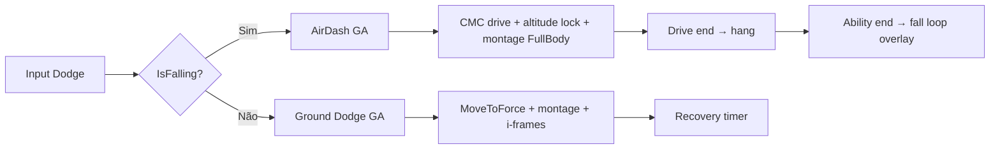

# Auditoria — Jump / Dash / Combo (2026-05)

Análise completa dos três sistemas após a estabilização do air dash + fall loop.  
Build verificada: `DungeonForgedEditor Win64 Development` ✅

---

## 1. Sistema de Pulo — `UDFCharacterMovementComponent`

### Status

**Substancialmente completo em C++.** Não é mais `ACharacter::Jump()` vanilla.

| Feature | Status |
|---|---|
| Pulo grounded com tuning data-driven | ✅ |
| Coyote time (ledge drop, 0.10s) | ✅ |
| Input buffer (landing + ground-proximity, 0.15s) | ✅ |
| Apex cut (variable height, scale 0.40) | ✅ |
| Fall gravity multiplier (×1.25 pós-apex) | ✅ |
| Sprint jump horizontal boost (×1.25) | ✅ |
| Soft landing (damp 0.4 + brake 4096) | ✅ |
| Double jump (nativo, ×0.85 Z) | ✅ |
| Tags GAS movimento | ✅ local, ⚠️ replicação MP loose tag |
| AnimInstance state machine hints | ✅ |
| Air dash integration (fall loop) | ✅ |
| **Long fall landing anim** | ⚠️ flag only |
| **`AnimNotify_JumpApex`** | ⚠️ stub (só log) |

### Arquitetura

```
Input (IA_Jump) → ADFRunPlayerController::Input_JumpStart
  → ADFPlayerCharacter::Jump (gates: tags, buffer, attack window)
    → CMC::RequestJump → DoJump (cooldown, stamina, coyote, double jump, sprint boost)
      → MovementMode: Walking → Falling
        → OnMovementModeChanged → GAS tags + combo preserve check
          → Tick: fall gravity, jump→fall tag swap
            → Land → recovery timer + buffer consume
```

### Tags GAS (loose, locais)

| Tag | Adicionada por | Removida por |
|-----|----------------|--------------|
| `State.Jumping` | `DoJump`, MovementMode (Vz>1) | Tick apex → Falling, landing |
| `State.Falling` | Ledge drop, tick pós-apex | Landing |
| `State.Landing` | CMC timer + `AnimNotifyState_LandingRecovery` | Timer, notify end, novo takeoff |
| `State.DoubleJumping` | `DoJump` double | Landing |

⚠️ **Replicação MP:** loose tags não replicam — `State.DoubleJumping` invisível para sim proxy remoto. Em MP, anim remota deve depender de `MovementMode`/`Velocity`, não da tag.

---

## 2. Sistema de Dash — `UDFAbility_Dodge` + `UDFAbility_AirDash`

### Comparativo

| Aspecto | Ground Dodge | Air Dash |
|---|---|---|
| Pré-condição | `!IsFalling()` | `IsFalling()` + `!bAirDodgeUsedThisJump` |
| Direção | **8-way** (`DFSnapLocalInputToDodgeDirection`, 45°) | **8-way** (mesmos helpers) |
| Fallback sem input | **Backward** (defensivo) | **Forward** (ofensivo) |
| Displacement | `MoveToForce` ou RM montage | `BeginAirDashDrive` (CMC) + altitude lock |
| Slot montage | nativo asset (`DefaultSlot`) | `FullBody` (dynamic se diferir) |
| Stamina | 20 | 15 |
| Cooldown | 0.70s (CMC + `CanActivate`) ✅ FIXED | 0.40s ✅ FIXED |
| I-frames | 0.35s (CMC timer) | 0.15s (GA timer) |
| **State.Invulnerable** | bloqueia dano ✅ FIXED | bloqueia dano ✅ FIXED |
| Cancela combo | Sim (`ResetCombo()`) | Não |
| Hang pós-drive | Não | Sim (altitude lock até ability end) |
| Re-sync com jump SM | N/A | `NotifyAirDashEndedWhileAirborne` |

### Pipeline de execução



---

## 3. Sistema de Combo — `UDFComboComponent`

### Status

**Núcleo maduro em C++**, depende de conteúdo (montages + notifies + DataAssets).

| Feature | Status |
|---|---|
| Chain data-driven (steps + variants) | ✅ |
| GAS LocalPredicted + cooldown bypass mid-chain | ✅ |
| Input buffer (swing + window) | ✅ |
| Janela por notify state + curva | ✅ |
| Hit-confirm window extension | ✅ |
| Heavy charge tiers (normal/max) | ✅ |
| Cancel hierarchy (`ANS_DFAbilityCancelWindow`) | ✅ |
| Replicação step + RPC chain | ✅ |
| Aerial continuation (preserve em jump) | ✅ FIXED (era sempre true) |
| **Tuning aplicado em runtime** | ✅ FIXED (era nunca chamado) |
| Hit registration | via `UDFMeleeTraceComponent` |

### Fluxo

```
LMB press → Buffer (window/swing) ou windup
LMB release → Tap: light swing | Hold: heavy (charge thresholds)
  → GAS ability (MeleeSwing / HeavyAttack)
    → Montage + trace windows (AN_TraceStart/End)
      → Hit confirmado → NotifyOwnerHitConfirmed (extend window)
        → Notify open window → AdvanceCombo
          → Input buffered? → chain ou reset
```

### Integração movimento

| Ação | Comportamento |
|------|---------------|
| Dodge | `ResetCombo()` imediato |
| Jump | Preserve se cancel window **ou** `HasAerialContinuation()` (agora exige combo ativo) |
| Jump em recovery | `CancelCurrentMontage()` se `AbilityCancelWindow.Open` |
| Air dash | Sem hook direto (interação só via tags/movement) |

---

## 4. Bugs corrigidos nesta auditoria

### 🔴 Crítico — `State.Invulnerable` era cosmético

`DFDamageCalculation::Execute_Implementation` **não checava** a tag. I-frames de dodge / air dash / buff shield (`UGE_Buff_Shield`, `UGE_Boss_VoidBarrier`, `UGE_Teleport_IFrame`, `UDFCheatManager::god`) só apareciam como "IMMUNE" no `UDFHitReactionComponent`, mas o dano era aplicado.

**Fix:** early return em `Execute_Implementation` se target tem `State.Invulnerable`.  
**Nota:** `UDFTrueDamageExecution` mantém bypass intencional (true damage atravessa imunidade).

```33:42:Source/DungeonForged/Private/GAS/DFDamageCalculation.cpp
void UDFDamageCalculation::Execute_Implementation(const FGameplayEffectCustomExecutionParameters& ExecutionParams,
	FGameplayEffectCustomExecutionOutput& OutExecutionOutput) const
{
	const UAbilitySystemComponent* const TargetASC = ExecutionParams.GetTargetAbilitySystemComponent();
	if (!TargetASC)
	{
		return;
	}

	if (FDFGameplayTags::State_Invulnerable.IsValid()
		&& TargetASC->HasMatchingGameplayTag(FDFGameplayTags::State_Invulnerable))
```

### 🔴 Crítico — `ApplyCombatTuningFromDataAsset` nunca era chamado

`UDFComboComponent` definia o método mas nunca o invocava. Tuning `DA_CombatTuning` (ComboWindowDuration, HeavyChargeThreshold, etc.) era completamente **ignorado** em runtime.

**Fix:** chamado em `BeginPlay()`.

### 🟡 Alto — Air dash cooldown não enforced

Campo `AirDashCooldown = 0.40s` existia no CMC e tuning mas **nunca era checado**. Único limite era `bAirDodgeUsedThisJump` (1 por arco).

**Fix:** `GetAirDashCooldownRemaining()` no CMC + check em `UDFAbility_AirDash::CanActivateAbility`.

### 🟡 Alto — Tuning de Dodge não chegava ao CMC

`DodgeCooldown` e `DodgeIFrameDuration` em `UDFCombatTuningData` existiam mas `ApplyJumpTuningFromDataAsset` só copiava jump/air dash.

**Fix:** copia também `DodgeCooldown` e `IFrameDuration` no CMC.

### 🟡 Alto — Dodge `CanActivate` não verificava cooldown

GA podia ativar, drenar stamina e tocar montage **enquanto `PerformDodge` retornava early por cooldown** — anim sem deslocamento/i-frames.

**Fix:** `CanActivateAbility` agora rejeita se `GetDodgeCooldownRemaining() > 0`.

### 🟢 Médio — Defaults conflitantes (Jump Z)

CMC header tinha `DFJumpZVelocity = 550` enquanto DataAsset usava `750`. Confuso ao tunar via BP do CMC sem perceber que asset sobrescreve.

**Fix:** alinhei header para `750` + comentário documentando precedência do DataAsset.

### 🟢 Médio — `HasAerialContinuation()` sempre true

`return AerialComboSteps.Num() > 0;` — qualquer pulo preservava combo se array configurado, mesmo sem combo ativo. Causava bugs sutis de chain stale.

**Fix:** exige `AerialComboSteps.Num() > 0` **E** combo ativo (step > 0, window/buffer ativo, ou lock pendente).

---

## 5. Pendências (não fixadas — config/conteúdo)

### Editor / DataAssets

1. **`DA_CombatTuning`** — preencher `DodgeCooldown` e `DodgeIFrameDuration` se quiser overridar defaults CMC (0.7 / 0.35).
2. **`DT_Abilities`** — confirmar row `AirDash` com tag `Ability.Movement.AirDash` e classe `GA_Knight_AirDash`.
3. **Montages air dash** — slot **`FullBody`** (atualmente `DefaultSlot` força dynamic montage, log MISMATCH).
4. **`AerialComboSteps`** no BP do `UDFComboComponent` — preencher se quiser combos aéreos.
5. **AnimBP `ABP_JSHeroCharacter`** — confirmar wiring:
   - `Locomotion → Jump Loop`: `bTransition Locomotion To Jump Loop`
   - `Jump Loop → Locomotion`: `bTransition Jump Loop To Locomotion` (nova variável, simpler que `NOT(GndExit AND KeepLoop)`)

### Refactor recomendado (não bloqueante)

1. **Unificar i-frames**: dodge usa CMC timer, air dash usa GA timer. Mover ambos para o mesmo lugar (preferir CMC com `IFrameDuration` + start/stop methods).
2. **Loose tags GAS replicadas**: para MP, considerar usar `State.DoubleJumping` via `AddReplicatedLooseGameplayTag()` ou GE com tag granted.
3. **`bLockAltitudeDuringDash`** — flag morta (só debug). Remover ou implementar opt-out.
4. **`AnimNotify_JumpApex`** — atualmente só log; conectar a evento delegado para hooks VFX/SFX em BP.
5. **`State.Landing` triple source** — CMC timer + AnimNotifyState + AnimInstance timer. Consolidar em uma única fonte.
6. **Per-weapon `ComboWindowDuration`** — sugerido em `docs/improvements/03_Combat.md`, não implementado.

### Documentação

1. Criar `docs/improvements/16_AirDash.md` (não existe).
2. Atualizar `docs/improvements/17_JumpSystem.md` — seção "O que falta" lista features já implementadas (coyote, buffer, tags).

---

## 6. Comandos de debug úteis

| Comando | Função |
|---------|--------|
| `df.DebugAirDash 0..3` | Air dash log/HUD/path dots |
| `df.DodgeDebug 0..2` | Dodge log/HUD |
| `df.DodgeDebug dump` | Dump estado CMC + tags |
| `df.JumpDebug 0..4` | Jump SM transitions, deep snapshot |
| `df.JumpDebug dump` | Snapshot completo AnimInstance + CMC |
| `df.CombatDebug Combo` | Overlay combo state |
| `df.CombatDebug Heavy` | Overlay heavy charge |

---

## 7. Próximos passos sugeridos

**Curto prazo (gameplay feel):**
- Testar PIE: dodge spam, air dash spam, dano durante i-frames (deve ser bloqueado agora).
- Tunar `DA_CombatTuning` se as defaults do CMC não bastarem.
- Validar AnimBP wiring após mudanças (overlay fall loop pós-dash).

**Médio prazo (MP):**
- Audit replicação loose tags.
- Aplicar prediction window correta para combo chain em latência.

**Longo prazo (conteúdo):**
- Montages 8-way por stance (armed/unarmed).
- Aerial combo steps.
- Long-fall land anim dedicada.
