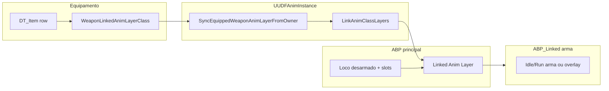

# DungeonForged — Camadas de animação: desarmado vs armado (Layer Interface + ABP)

Guia para montar **locomoção**, **idle** e **ataque** quando o jogador está **sem arma** ou **com arma**, usando **`UAnimLayerInterface`**, **`Linked Anim Layers`** e o fluxo já exposto pelo C++ (`UUDFAnimInstance`, `WeaponLinkedAnimLayerClass`).

**Documento relacionado:** `Source/DungeonForged/Public/Animation/ABP_DungeonForged_Authoring.md` (blend spaces, state machine base, upper body por bone).

---

## 1. O que o projeto já faz por ti

No **tick de animação** (`NativeUpdateAnimation`), `UUDFAnimInstance`:

- Lê **equipamento** no slot `Weapon` através de `UDFEquipmentComponent`.
- Actualiza **`bHasWeaponEquipped`**, **`EquippedWeaponItemRow`**.
- Carrega **`FDFItemTableRow::WeaponLinkedAnimLayerClass`** e chama **`LinkAnimClassLayers` / `UnlinkAnimClassLayers`** quando a classe mudar (`SyncEquippedWeaponAnimLayerFromOwner`).

Ou seja:

- **Sem layer no item** → só corre o AnimGraph da **instância base** (ABP principal ligada ao personagem).
- **Com classe no campo `WeaponLinkedAnimLayerClass` da arma** na Data Table (`DT_Items` ou equivalente) → essa classe de **Linked Layer** é activada ao equipar e removida ao desequipar.

Funções BP úteis (debug):

- **`LinkWeaponAnimLayerClass`** / **`UnlinkWeaponAnimLayerClass`**
- **`ApplyAnimSet`** / **`RevertToDefaultAnimSet`**

### Anim set em runtime (estilo Elder)

- **`FUDAnimSet`** está em `Animation/DFAnimSetTypes.h` (**Idle**, **Movement Blend Space**, **jump**).
- **`UUDFAnimInstance::DefaultAnimSet`** — valores por defeito no **Class Defaults** do ABP (desarmado).
- **`ActiveAnimSet`** — cópia inicial = `Default`; no **AnimGraph** usa **`Break ActiveAnimSet`** (não só `DefaultAnimSet`) para BS dinâmico.
- **`DT_Items` → `WeaponAnimSet`** por arma: ao **equipar** / **desequipar** / **`OnRep_Loadout`**, `UDFEquipmentComponent` chama `ApplyAnimSet` se o set for válido (**Idle ou Movement BS** preenchido), senão `RevertToDefaultAnimSet`.

**Linked layers (`ABP_*_Layer`):** o `WeaponAnimSet` mexe no **`AnimInstance` raiz da mesh do personagem** (`GetMesh()->GetAnimInstance()`, o mesmo `ABP_ElfCharacter`). Cada layer tem **sub-instâncias** diferentes; **`Break ActiveAnimSet` no próprio layer** só vê defaults **desse** ABP layer. Para animação igual ao Elder, dentro do subgraph da layer faz **cast** do `Owning Component → Get Anim Instance →` **`UUDFAnimInstance`** e lê **`Active Anim Set`** dali — ou canaliza já no grafo principal a pose de locomotion antes do nó Linked Layer.

---

## 2. Estratégia recomendada (base + layer armado)

| Camada | Conteúdo típico |
|--------|------------------|
| **ABP principal (base)** | Locomoção desarmado: Idle, Run/Walk (`BS_*`), Jump/Land; estado de combate se quiseres; **slot UpperBody** para montagens soco / stagger. Mantém-te alinhado com `ABP_DungeonForged_Authoring.md`. |
| **Linked Anim Layer armado** | Poses só com arma idle/run (ou só **upper body** sobre a base — ver secção 6); transições de **draw/sheath** opcionais aqui ou em montagens no slot; animação de golpe também pode ficar só em montagem slot. |

Vantagens: uma única locomotion base consistente; **por tipo de arma** podes ter um `ALI`/`ABP_PlLayer_Sword`, `ABP_PlLayer_Axe`, etc., apontados na row do item.

**Alternativa (sem Layer Interface):** um único ABP grande com **`bHasWeaponEquipped`** a multiplicar estados dentro da mesma state machine — funciona mas escala mal com muitas armas.

---

## 3. Criar a Animation Layer Interface (Blueprint)

1. **Anim Layer Interface:** `Content` → clicar direito → **Animation → Anim Layer Interface** (ex.: `ALI_PlayerCombat`).
2. Abre o asset e usa **Layer Setup** ou adicionas **Layer Graphs** conforme o teu UE 5.4:
   - Nome habitual: algo como **`ArmedOverlay`** ou **`WeaponLocomotion`** — o importante é que o nome do **linked graph/layer node** corresponda ao declarado na interface.
3. A interface define **assinaturas** (inputs de pose opcionais — costuma usar-se **`PoseLink BasePose`** quando o grafo ligado faz *overlay*).

Copia o mesmo padrão das templates da Epic (Third Person Sample / Lyra-style): Interface com um ou poucos grafos nomeados estáveis.

---

## 4. ABP principal (personagem jogador)

1. **Anim Class:** herda **`UUDFAnimInstance`** (ou o teu `ABP_Player` já derivado dessa classe C++ — ver parent class no Anim Blueprint).
2. No **AnimGraph**:
   - Monta primeiro a **Full Body locomotion** (Idle / Blend Space — ver doc de authoring).
   - Para **slots** (`DefaultSlot`, **`UpperBody`**, etc.), coloca depois **`Layered blend per bone`** se precisares de torso separado dos pés durante ataque (`ABP_DungeonForged_Authoring.md`, secção *Upper body*).
3. Arrasta **`Linked Anim Layer`** (ou nó compatível UE5.4) e escolhe a **`ALI_PlayerCombat`** criada antes.
   - Liga a **entrada Base** à pose já preparada pela locomotion (+ upper body opcional antes do layer armado — depende da tua ordenação).

**Importantíssimo:** a classe C++ **`UAnimLayerInterface`** que o UE gera quando compilas **Interface Blueprint** deve ser a ancestor **effective** das classes de layer (o linked layer AnimBP parent class será do tipo **`UAnimInstance` implementando aquela interface** — no editor isso aparece quando defines o parent na sub-ABP de layer).

---

## 5. ABP Linked Layer (uma por “estilo de arma”, não obrigatoriamente por mesh)

Para cada modo armado:

1. Cria **`AnimBlueprint`** do tipo **`Anim Instance`** compatível com o esqueleto do jogador (mesmo Skeleton que o mesh).
2. **Parent Class:** deves usar a classe ligada ao **Anim Layer Interface** (no editor UE5: escolher a interface quando pedir “implement layer interface” ou herdar template gerado).
3. No grafo ligado pela interface:

   **Opção A — Full body só armado**

   - State machine paralela só com Idle_Armado, Run_Armado, etc., usando as mesmas variáveis `Speed`, `Direction`, `bShouldStrafe` vindas da instância **pais** (`UUDFAnimInstance`): em Blueprint lê-te `TryGetPawnOwner`/`OwningCharacter`/cast para aceder aos mesmos valores expostos (ou já estão disponíveis no linked instance synced — ver documentação UE para replicação de properties na layer).

   **Opção B — Só torso (overlay)**

   - Entrada **`BasePose`** = corpo já animado pela base layer.
   - Acima usa **Blend Layers** apenas de `spine_01` (ou osso configurado equivalente ao Mannequin) com idle arma + aim offset opcional.

4. Compile e guarda. O **Nome do asset Blueprint** será referenciável como classe no Editor.

Na **Data Table** do item (struct `FDFItemTableRow`):

- **`WeaponLinkedAnimLayerClass`** → `ABC_PlayerLayer_Sword` (exemplo).

Sem valor → comportamento só **desarmado** na base.

---

## 6. Idle, corrida e ataque

### Locomoção (idle/run)

- **Desarmado:** `BS_Locomotion_Standard` / `BS_Locomotion_8Way` na **ABP principal** com `Speed`, `Direction`, `bShouldStrafe`.
- **Armado:** Ou duplicas a lógica na **linked layer** com animações diferentes, ou Manténs só **upper-additive idle** nas mãos e deixas pernas igual à base (**Opção B** da secção 5).

### Ataques

Combates no DungeonForged usam bastante **Gameplay Abilities + montagens** (ex.: `WeaponMeleeGameplayAbility`, `WeaponMeleeComboMontages` na row).

1. Preferir **`Slot`** `UpperBody` (ou grupo definido pelo projeto) na **ABA que está a avaliar quando a montagem toca** — normalmente a **principal** já tem esse slot antes do resultado final ao ecrã.
2. Garantir que quando a montagem só afecta torso, há **`Layered blend per bone`** a partir dos ossos correctos (`spine_01` típico).
3. **`bIsAttacking`** no `UUDFAnimInstance` vem de tag GAS (`State_Attacking`): podes usar em transições SM para não misturar outros estados.

Se o golpe armado usar **layer** em vez de slot, garante **`SetReceiveNotifiesFromLinkedInstances` / propagation** conforme precisamento (ver skill `ue-animation-system` ou docs Epic).

---

## 7. Checklist de falhas comuns

| Sintoma | Causa provável |
|--------|-----------------|
| Equipei arma e nada muda | `WeaponLinkedAnimLayerClass` na row vazio; Skeleton da layer diferente do mesh; parent class não implementa mesma **`ALI`** do nó Linked na base. |
| Layer “pisado” inteiro pela base | Nó **Linked Anim Layer** antes da pose final incorrecto; entrada Base não está ligada. |
| Ataque não aparece | Montagem com **Slot Name** diferente do que o AnimGraph espera; SM base a fazer bypass do slot; montagem só no layer mas slot só na principal. |
| Twist weird em strafe armado | `bShouldStrafe` + animações apenas forward — falta BS 8-way na layer ou blend por `Direction`. |

---

## 8. Resumo do fluxo de dados

---

## 9. Próximo passo

Depois de teres uma primeira layer a funcionar, regista no teu backlog: **umas sequências montadas** só em slot para validar antes de mover lógica toda para state machines dentro da linked layer — reduz ciclo de debug.
