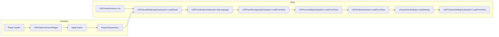

# 10 — Settings & Options

> **Objetivo:** entregar um menu de **opções completo, persistente e localizado** — Audio, Graphics (resolução, vsync, quality), Controls (rebind), Accessibility, Language. Padrão "set once and forget".

> Arquivos: [`Source/DungeonForged/Public/Localization/UDFOptionsScreenWidget.h`](../../Source/DungeonForged/Public/Localization/UDFOptionsScreenWidget.h),
> [`Source/DungeonForged/Public/Localization/UDFLocalizationSubsystem.h`](../../Source/DungeonForged/Public/Localization/UDFLocalizationSubsystem.h),
> [`Source/DungeonForged/Public/Localization/UDFInputRemappingSubsystem.h`](../../Source/DungeonForged/Public/Localization/UDFInputRemappingSubsystem.h),
> [`Source/DungeonForged/Public/Localization/UDFAccessibilitySubsystem.h`](../../Source/DungeonForged/Public/Localization/UDFAccessibilitySubsystem.h),
> [`Source/DungeonForged/Public/Run/DFSaveGame.h`](../../Source/DungeonForged/Public/Run/DFSaveGame.h).

---

## Sumário rápido

| Eixo | Atual | Alvo | Esforço |
|---|---|---|---|
| Audio | 4 sliders (Master/Music/SFX/Voice) | + slider Ambient, slider UI; mute toggles | 1h |
| **Graphics** | **stub / vazio** | resolução, fullscreen mode, vsync, fps cap, 4 quality presets, FOV | 6-8h |
| Controls | keybind list view OK | + conflito detection, gamepad glyphs, dead-zone | 4h |
| Accessibility | font, contrast, motion, colorblind | + camera shake %, hit stop %, damage nums, hold-to-toggle | 3h |
| Language | 4 idiomas (PT-BR/EN/ES/FR) | + preview live, fallback ao English se string faltar | 2h |
| Apply flow | aplica imediato | "Apply" + "Discard" buttons, confirmação 10s | 2h |
| Persistência | `DFSaveGame` parcial | confirm `UGameUserSettings` save em todas as abas | 1h |
| Defaults | reset só keybinds | "Reset to defaults" por aba | 30min |

---

## 1. Graphics tab — implementar `[CODE/UI]` <a id="graphics"></a>

**🔥 Crítico — atualmente vazio.**

### 1.1 Estrutura

```cpp
// Source/DungeonForged/Public/Settings/UDFGraphicsSettingsHelper.h
UENUM(BlueprintType)
enum class EDFFullscreenMode : uint8
{
    Fullscreen        UMETA(DisplayName="Fullscreen"),
    WindowedBorderless UMETA(DisplayName="Borderless Windowed"),
    Windowed          UMETA(DisplayName="Windowed"),
};

UENUM(BlueprintType)
enum class EDFGraphicsPreset : uint8
{
    Low      UMETA(DisplayName="Low"),
    Medium   UMETA(DisplayName="Medium"),
    High     UMETA(DisplayName="High"),
    Epic     UMETA(DisplayName="Epic"),
    Custom   UMETA(DisplayName="Custom"),
};

UCLASS()
class UDFGraphicsSettingsHelper : public UBlueprintFunctionLibrary
{
    GENERATED_BODY()
public:
    UFUNCTION(BlueprintCallable, Category="DF|Graphics")
    static TArray<FIntPoint> GetSupportedResolutions();

    UFUNCTION(BlueprintCallable, Category="DF|Graphics")
    static FIntPoint GetCurrentResolution();

    UFUNCTION(BlueprintCallable, Category="DF|Graphics")
    static void ApplyResolution(FIntPoint Resolution, EDFFullscreenMode Mode);

    UFUNCTION(BlueprintCallable, Category="DF|Graphics")
    static void ApplyPreset(EDFGraphicsPreset Preset);

    UFUNCTION(BlueprintCallable, Category="DF|Graphics")
    static void ApplyVSync(bool bOn);

    UFUNCTION(BlueprintCallable, Category="DF|Graphics")
    static void ApplyFrameRateCap(int32 FpsCap);   // 0 = unlimited

    UFUNCTION(BlueprintCallable, Category="DF|Graphics")
    static void ApplyFOV(float DegHorizontal);

    UFUNCTION(BlueprintCallable, Category="DF|Graphics")
    static void SaveAll();
};
```

### 1.2 Implementação

```cpp
TArray<FIntPoint> UDFGraphicsSettingsHelper::GetSupportedResolutions()
{
    TArray<FIntPoint> Out;
    UKismetSystemLibrary::GetSupportedFullscreenResolutions(Out);
    return Out;
}

void UDFGraphicsSettingsHelper::ApplyResolution(FIntPoint Resolution, EDFFullscreenMode Mode)
{
    UGameUserSettings* GS = GEngine->GetGameUserSettings();
    if (!GS) return;
    GS->SetScreenResolution(Resolution);
    EWindowMode::Type WM = EWindowMode::Fullscreen;
    switch (Mode)
    {
        case EDFFullscreenMode::Fullscreen:         WM = EWindowMode::Fullscreen; break;
        case EDFFullscreenMode::WindowedBorderless: WM = EWindowMode::WindowedFullscreen; break;
        case EDFFullscreenMode::Windowed:           WM = EWindowMode::Windowed; break;
    }
    GS->SetFullscreenMode(WM);
    GS->ApplyResolutionSettings(/*bCheckForCommandLineOverrides=*/false);
}

void UDFGraphicsSettingsHelper::ApplyPreset(EDFGraphicsPreset P)
{
    UGameUserSettings* GS = GEngine->GetGameUserSettings();
    if (!GS) return;
    int32 Q = 0;
    switch (P)
    {
        case EDFGraphicsPreset::Low:    Q = 0; break;
        case EDFGraphicsPreset::Medium: Q = 1; break;
        case EDFGraphicsPreset::High:   Q = 2; break;
        case EDFGraphicsPreset::Epic:   Q = 3; break;
        case EDFGraphicsPreset::Custom: return;   // não toca scalability
    }
    GS->SetViewDistanceQuality(Q);
    GS->SetShadowQuality(Q);
    GS->SetGlobalIlluminationQuality(Q);
    GS->SetReflectionQuality(Q);
    GS->SetAntiAliasingQuality(Q);
    GS->SetPostProcessingQuality(Q);
    GS->SetTextureQuality(Q);
    GS->SetVisualEffectQuality(Q);
    GS->SetFoliageQuality(Q);
    GS->SetShadingQuality(Q);
    GS->ApplySettings(/*bCheckForCommandLineOverrides=*/false);
}

void UDFGraphicsSettingsHelper::ApplyVSync(bool bOn)
{
    if (UGameUserSettings* GS = GEngine->GetGameUserSettings())
    {
        GS->SetVSyncEnabled(bOn);
        GS->ApplySettings(false);
    }
}

void UDFGraphicsSettingsHelper::ApplyFrameRateCap(int32 FpsCap)
{
    if (UGameUserSettings* GS = GEngine->GetGameUserSettings())
    {
        GS->SetFrameRateLimit(static_cast<float>(FMath::Clamp(FpsCap, 0, 240)));
        GS->ApplySettings(false);
    }
}

void UDFGraphicsSettingsHelper::ApplyFOV(float Deg)
{
    // Custom: salvar em DFSaveGame e ler no UDFCameraComponent
    if (UDFCameraSettingsSubsystem* CS = GI->GetSubsystem<UDFCameraSettingsSubsystem>())
    {
        CS->SetHorizontalFOV(FMath::Clamp(Deg, 60.f, 110.f));
    }
}

void UDFGraphicsSettingsHelper::SaveAll()
{
    if (UGameUserSettings* GS = GEngine->GetGameUserSettings())
        GS->SaveSettings();
}
```

### 1.3 Widgets do Graphics tab

Adicionar em `UDFOptionsScreenWidget.h`:

```cpp
/* Graphics */
UPROPERTY(meta = (BindWidgetOptional))
TObjectPtr<UComboBoxString> Combo_Resolution = nullptr;
UPROPERTY(meta = (BindWidgetOptional))
TObjectPtr<UComboBoxString> Combo_FullscreenMode = nullptr;
UPROPERTY(meta = (BindWidgetOptional))
TObjectPtr<UComboBoxString> Combo_GraphicsPreset = nullptr;
UPROPERTY(meta = (BindWidgetOptional))
TObjectPtr<UCheckBox> Check_VSync = nullptr;
UPROPERTY(meta = (BindWidgetOptional))
TObjectPtr<USlider> Slider_FrameRateCap = nullptr;   // 30..240 + "Unlimited"
UPROPERTY(meta = (BindWidgetOptional))
TObjectPtr<UTextBlock> Text_FrameRateCapValue = nullptr;
UPROPERTY(meta = (BindWidgetOptional))
TObjectPtr<USlider> Slider_FOV = nullptr;            // 60..110
UPROPERTY(meta = (BindWidgetOptional))
TObjectPtr<UTextBlock> Text_FOVValue = nullptr;
UPROPERTY(meta = (BindWidgetOptional))
TObjectPtr<UButton> Button_ApplyGraphics = nullptr;
```

Handlers em `OnTabButtonGraphics`:
1. `RefreshSupportedResolutions()` → popular `Combo_Resolution`.
2. `RefreshFullscreenModes()` → popular 3 opções.
3. `RefreshPresets()` → 5 opções.
4. Sincronizar valores atuais do `UGameUserSettings`.

### 1.4 Apply-with-confirm

Mudanças de resolução **podem quebrar** (monitor não suporta). Padrão Windows:

```cpp
void UDFOptionsScreenWidget::ApplyGraphicsWithConfirmation()
{
    // 1. Snapshot atual
    PendingGraphics.Resolution = UDFGraphicsSettingsHelper::GetCurrentResolution();
    // ... outros campos ...

    // 2. Aplicar nova
    UDFGraphicsSettingsHelper::ApplyResolution(NewResolution, NewMode);

    // 3. Show confirm widget com countdown 10s
    ShowConfirmWidget(TEXT("Keep these graphics settings? Reverting in 10s..."));
    World->GetTimerManager().SetTimer(GraphicsRevertTimer, this, &ThisClass::RevertGraphicsIfNotConfirmed, 10.f, false);
}

void UDFOptionsScreenWidget::ConfirmGraphics()
{
    World->GetTimerManager().ClearTimer(GraphicsRevertTimer);
    UDFGraphicsSettingsHelper::SaveAll();
    HideConfirmWidget();
}

void UDFOptionsScreenWidget::RevertGraphicsIfNotConfirmed()
{
    UDFGraphicsSettingsHelper::ApplyResolution(PendingGraphics.Resolution, PendingGraphics.Mode);
    HideConfirmWidget();
    ShowToast(TEXT("Settings reverted (no confirmation)."));
}
```

---

## 2. Audio polish — `[CODE]` <a id="audio"></a>

### 2.1 Adicionar 2 sliders

Audio classes do projeto (presumido em `Content/Audio/SoundClasses/`):

| Slider | SoundClass | Default | Comentário |
|---|---|---|---|
| Master | `SC_Master` | 1.0 | já existe |
| Music | `SC_Music` | 0.7 | já existe |
| SFX | `SC_SFX` | 1.0 | já existe |
| Voice | `SC_Voice` | 1.0 | já existe |
| **Ambient** | `SC_Ambient` | 0.6 | wind, dungeon hum |
| **UI** | `SC_UI` | 0.8 | clicks, hover SFX |

```cpp
UPROPERTY(meta = (BindWidgetOptional))
TObjectPtr<USlider> Slider_Ambient = nullptr;
UPROPERTY(meta = (BindWidgetOptional))
TObjectPtr<USlider> Slider_UI = nullptr;
```

### 2.2 Mute toggles

Cada slider pode ter um botão "🔇 Mute" ao lado. Mute = volume 0 mantendo o valor anterior salvo (toggle restaura).

```cpp
void UDFOptionsScreenWidget::ToggleMuteChannel(EDFSoundChannel Channel)
{
    UDFAudioSubsystem* A = ...->GetSubsystem<UDFAudioSubsystem>();
    if (!A) return;
    float const Current = A->GetChannelVolume(Channel);
    if (Current > KINDA_SMALL_NUMBER)
    {
        SavedVolumeBeforeMute.Add(Channel, Current);
        A->SetChannelVolume(Channel, 0.f);
    }
    else
    {
        float const Restore = SavedVolumeBeforeMute.FindRef(Channel);
        A->SetChannelVolume(Channel, FMath::Max(0.05f, Restore));   // mínimo audível
    }
}
```

### 2.3 Preview ao tunar

Quando player solta o slider `Slider_SFX`, tocar `SFX_PreviewClick`. Solta `Slider_Music` → toca `SFX_MusicPreview` (4s loop snippet). Solta `Slider_Voice` → toca `SFX_VoicePreview` ("Hello, adventurer.").

---

## 3. Controls polish — `[CODE]` <a id="controls"></a>

**Onde:** `UDFInputRemappingSubsystem`, `BuildKeybindRows`, `BeginRebindForMapping`.

### 3.1 Conflito detection

Quando player tenta bindar `E` (já bindado em `IA_Interact`) para `IA_AbilityBarSlot5`:

```cpp
void UDFInputRemappingSubsystem::RequestSetKeyForMapping(FName Mapping, FKey NewKey)
{
    FName ConflictMapping = NAME_None;
    for (auto& Pair : CurrentBindings)
    {
        if (Pair.Key != Mapping && Pair.Value == NewKey)
        {
            ConflictMapping = Pair.Key;
            break;
        }
    }
    if (!ConflictMapping.IsNone())
    {
        OnBindingConflict.Broadcast(Mapping, ConflictMapping, NewKey);
        return;
    }
    ApplyBinding(Mapping, NewKey);
}
```

UI mostra dialog: `"E is bound to 'Interact'. Swap?"` — Yes troca; No cancela.

### 3.2 Listening UI

Quando player clica "Rebind" no slot, mostrar dialog:
```
┌────────────────────────────┐
│ Press any key for          │
│ Ability Slot 5             │
│                            │
│ [ESC] to cancel            │
└────────────────────────────┘
```

`NativeOnKeyDown` captura próximo key não-ESC e aplica. Já tem hook em `UDFOptionsScreenWidget::NativeOnKeyDown` — precisa polish do widget visual.

### 3.3 Gamepad glyphs em rebind row

Se player segura `Y` no gamepad, row mostra ícone do botão Y. Helper:

```cpp
// UDFInputRemappingHelpers.h
UTexture2D* ResolveKeyGlyph(FKey Key, EDFInputGlyphSet Set);   // Set = Xbox / PS / Generic
```

`DT_InputGlyphs` (FKey → UTexture2D × 3 sets).

### 3.4 Stick dead-zone slider

```cpp
UPROPERTY(meta = (BindWidgetOptional))
TObjectPtr<USlider> Slider_DeadzoneLeft = nullptr;    // 0.0..0.4
UPROPERTY(meta = (BindWidgetOptional))
TObjectPtr<USlider> Slider_DeadzoneRight = nullptr;

UPROPERTY(meta = (BindWidgetOptional))
TObjectPtr<USlider> Slider_LookSensitivityX = nullptr;   // 0.3..3.0
UPROPERTY(meta = (BindWidgetOptional))
TObjectPtr<USlider> Slider_LookSensitivityY = nullptr;

UPROPERTY(meta = (BindWidgetOptional))
TObjectPtr<UCheckBox> Check_InvertY = nullptr;
```

Aplicar via `UEnhancedInputUserSettings` (Enhanced Input 5.4 já tem APIs).

---

## 4. Accessibility polish — `[CODE]` <a id="accessibility"></a>

Já existe `UDFAccessibilitySubsystem` (HighContrast, ReduceMotion, ColorBlind, FontScale). Adicionar **5 sliders** que [doc 08](08_Accessibility.md) lista mas que ainda **não estão wireados** ao subsystem:

### 4.1 Sliders novos

| Slider | Range | Default | Aplica em |
|---|---|---|---|
| **Camera Shake %** | 0..100% | 100% | `UDFCameraShakeFunctionLibrary::ScaleMultiplier` |
| **Hit Stop %** | 0..100% | 100% | `UDFHitStopSubsystem::IntensityMultiplier` |
| **Screen Flash %** | 0..100% | 100% | `UDFScreenEffectsComponent::IntensityMultiplier` |
| **Damage Numbers** | On/Off | On | `UDFCombatTextSubsystem::bEnabled` |
| **HUD Opacity** | 30..100% | 100% | `UDFInGameHUDWidget::SetRenderOpacity` |
| **Hold → Toggle** | On/Off | Off | `Sprint`/`Block`/`Aim` viram toggle quando On |
| **Subtitles** | On/Off + scale | On + 1.0× | dialogue widget |
| **Subtitle background** | 0..100% opacity | 70% | dialogue widget BG |

Cada slider salva em `DFSaveGame::AccessibilitySettings`.

### 4.2 Visual de preview

Ao mover `Slider_CameraShake`, **trigger preview shake** ao vivo (ex: `UDFCameraShakeFunctionLibrary::PlayHitShake(World->GetFirstPlayerController())`). Mostra exatamente o que vai sentir.

### 4.3 Reset to defaults

Botão "Reset Accessibility to Defaults" volta todos para os valores acima.

---

## 5. Language polish — `[CODE]` <a id="language"></a>

**Onde:** [`UDFLocalizationSubsystem.h`](../../Source/DungeonForged/Public/Localization/UDFLocalizationSubsystem.h) — suporta 4 idiomas: PT-BR, EN, ES, FR.

### 5.1 Preview live

Hoje `RefreshLanguagePreview` mostra uma string sample. Sugestão: preview com **3-4 strings dinâmicas**:

```cpp
void UDFOptionsScreenWidget::RefreshLanguagePreview()
{
    if (!Text_LanguagePreview) return;
    FString const Culture = LanguageToCultureCode(PendingLanguage);
    FInternationalization::Get().SetCurrentCulture(Culture);   // SCOPED only-preview

    FText const Sample = FText::Format(
        NSLOCTEXT("DF.Preview", "PreviewBlock",
        "{Greeting}\n• {AbilitySample}\n• {ItemSample}\n• {DialogueSample}"),
        FFormatNamedArguments{
            {TEXT("Greeting"),       NSLOCTEXT("DF.Preview", "Greeting",       "Welcome, adventurer.")},
            {TEXT("AbilitySample"),  NSLOCTEXT("DF.Preview", "AbilitySample",  "Fireball — 80 fire damage")},
            {TEXT("ItemSample"),     NSLOCTEXT("DF.Preview", "ItemSample",     "Healing Potion (restores 50 HP)")},
            {TEXT("DialogueSample"), NSLOCTEXT("DF.Preview", "DialogueSample", "I have wares, if you have coin.")},
        });
    Text_LanguagePreview->SetText(Sample);
    // Revert scoped culture: o subsystem só aplica quando "Apply" pressed.
}
```

### 5.2 Fallback ao English

Quando string falta no idioma escolhido, `FText` retorna namespace+key ao invés do fallback. Forçar fallback:

```cpp
void UDFLocalizationSubsystem::ApplyCulture(const FString& Code, EDFLanguage L, bool bSave)
{
    FInternationalization& I18N = FInternationalization::Get();
    I18N.SetCurrentLanguage(Code);
    I18N.SetCurrentLocale(Code);
    // Fallback chain: chosen → English → native
    I18N.SetCurrentAssetGroupCulture(NAME_None, Code);
    CurrentLanguage = L;
    CurrentCultureCode = Code;
    OnLanguageChanged.Broadcast(L);
    if (bSave)
    {
        if (UDFSaveSlotManagerSubsystem* SM = GetGameInstance()->GetSubsystem<UDFSaveSlotManagerSubsystem>())
        {
            SM->GetSaveGame()->PreferredLanguage = L;
            SM->RequestSaveAsync();
        }
    }
}
```

Validar `Engine/Config/BaseGame.ini` tem fallback culture configurado:
```ini
[Internationalization]
+CulturesToStage=en
+CulturesToStage=pt-BR
+CulturesToStage=es
+CulturesToStage=fr
NativeCulture=en
```

### 5.3 Missing-string audit

Comando debug:
```
df.i18n.audit   → loga strings com namespace+key não traduzidos no idioma corrente
```

```cpp
// UDFCheatManager
UFUNCTION(Exec)
void df_i18n_audit()
{
    int32 Missing = 0;
    TArray<FString> Out;
    FInternationalization::Get().GetLoadedCultures(Out);
    // iterar StringTables e listar entries sem tradução
    UE_LOG(LogDFLocalization, Display, TEXT("Missing %d translations in %s"),
           Missing, *I18N.GetCurrentLanguage()->GetName());
}
```

Útil antes de release.

### 5.4 Idiomas futuros

```cpp
// Adicionar a EDFLanguage:
German, Italian, Russian, Japanese, ChineseSimplified, Korean
```

Cada novo idioma = nova StringTable + entrada em `LanguageToCultureCode`.

---

## 6. Apply / Discard flow — `[CODE/UI]` <a id="apply-discard"></a>

### 6.1 Padrão hoje

`ApplyAudioFromSliders` aplica imediato; `ApplyAndSaveAccessibility` aplica + salva. Inconsistente.

### 6.2 Padrão sugerido

| Aba | Aplicar imediato? | Salva imediato? | Confirm? |
|---|---|---|---|
| Audio | Sim (feedback áudio) | On "Close" tab | Não |
| Graphics | Sim (preview) | On "Apply" button | **Sim (resolução, fullscreen)** — 10s revert |
| Controls | Sim (rebind único) | On rebind | Não |
| Accessibility | Sim (preview live) | On "Apply" | Não |
| Language | **Não** (preview only) | On "Apply" | Não (rebuild UI) |

### 6.3 "Discard" footer

Toda aba tem footer:

```
┌──────────────────────────────────────────────┐
│  [Reset to Defaults]  [Discard]  [Apply]    │
└──────────────────────────────────────────────┘
```

`Discard` reverte ao estado em que abriu o menu. Implementação: snapshot em `NativeConstruct`, restore em `OnDiscardClicked`.

---

## 7. Persistência audit — `[CODE]` <a id="persistencia"></a>

Confirmar que **cada slider salva no slot correto**:

| Setting | Storage | Implementação |
|---|---|---|
| Audio volumes | `UDFAudioSubsystem` → `DFSaveGame::AudioVolumes` | confirm SaveAsync chamado |
| Resolution, vsync, fps cap, scalability | `UGameUserSettings::SaveSettings()` (engine) | `GameUserSettings.ini` |
| FOV | `DFSaveGame::FOV` (custom) | restore em `BeginPlay` |
| Keybinds | `DFSaveGame::SavedKeyBindings` (já existe) | confirm restore via subsystem |
| Accessibility | `DFSaveGame::AccessibilitySettings` (já existe) | restore via subsystem |
| Language | `DFSaveGame::PreferredLanguage` (já existe) | restore em GameInstance::Init |

### 7.1 Boot sequence sugerida

```cpp
// UDFGameInstance::Init (ou BeginPlay do GameMode)
1. Load DFSaveGame (UDFSaveSlotManagerSubsystem)
2. UDFLocalizationSubsystem.SetLanguage(Save.PreferredLanguage)
3. UDFInputRemappingSubsystem.LoadFromSave(Save.SavedKeyBindings)
4. UDFAccessibilitySubsystem.LoadFromSave(Save.AccessibilitySettings)
5. UDFAudioSubsystem.LoadFromSave(Save.AudioVolumes)
6. UGameUserSettings::LoadSettings (engine handles itself)
7. UDFCameraSettingsSubsystem.LoadFromSave(Save.FOV)
```

Confirmar essa ordem em `DungeonForgedModule.cpp` ou `UDFGameInstance::Init`.

### 7.2 Versionamento

`DFSaveGame.h:SaveVersion = 6` hoje. Cada novo campo de settings = bump version + migration function.

```cpp
void UDFSaveGame::MigrateIfNeeded()
{
    if (SaveVersion < 7)
    {
        // novo campo FOV — default 90
        FOV = 90.f;
    }
    if (SaveVersion < 8)
    {
        // novo campo HUDOpacity
        AccessibilitySettings.HUDOpacity = 1.f;
    }
    SaveVersion = CurrentSaveVersion;
}
```

---

## 8. Reset to defaults — `[CODE]` <a id="reset-defaults"></a>

Cada aba tem botão "Reset". Implementação:

```cpp
void UDFOptionsScreenWidget::ResetAudioToDefaults()
{
    if (UDFAudioSubsystem* A = ...->GetSubsystem<UDFAudioSubsystem>())
    {
        A->SetChannelVolume(EDFSoundChannel::Master, 1.0f);
        A->SetChannelVolume(EDFSoundChannel::Music, 0.7f);
        A->SetChannelVolume(EDFSoundChannel::SFX, 1.0f);
        A->SetChannelVolume(EDFSoundChannel::Voice, 1.0f);
        A->SetChannelVolume(EDFSoundChannel::Ambient, 0.6f);
        A->SetChannelVolume(EDFSoundChannel::UI, 0.8f);
    }
    SyncAudioFromSubsystem();   // atualiza UI
}

void UDFOptionsScreenWidget::ResetGraphicsToDefaults()
{
    UDFGraphicsSettingsHelper::ApplyResolution(GetNativeResolution(), EDFFullscreenMode::WindowedBorderless);
    UDFGraphicsSettingsHelper::ApplyPreset(EDFGraphicsPreset::High);
    UDFGraphicsSettingsHelper::ApplyVSync(true);
    UDFGraphicsSettingsHelper::ApplyFrameRateCap(0);
    UDFGraphicsSettingsHelper::ApplyFOV(90.f);
    UDFGraphicsSettingsHelper::SaveAll();
    RefreshGraphicsUI();
}

// análogo para Controls / Accessibility / Language
```

Confirmação modal: `"Reset Audio settings to defaults? This cannot be undone."` [Yes/No].

---

## 9. Open from anywhere — `[CODE]` <a id="open-from-anywhere"></a>

### 9.1 ESC key

Em qualquer lugar (Nexus, mid-run, main menu), `ESC` abre menu de pausa que tem botão "Options". No mid-run, abrir o menu **pausa o tempo** (`UGameplayStatics::SetGamePaused(World, true)`).

### 9.2 First-run setup

Primeira execução do jogo → detectar via `DFSaveGame::bFirstRunSetupDone`. Se false → forçar abrir aba Language + Accessibility antes do main menu, marcar true on Apply.

```cpp
// UDFGameInstance::Init
if (!SaveGame->bFirstRunSetupDone)
{
    OpenFirstRunSetup();   // widget dedicado com 2 passos
    SaveGame->bFirstRunSetupDone = true;
}
```

UX inclusivo — não obriga o jogador a navegar pelo menu de opções para configurar idioma na primeira vez.

---

## 10. Debug & telemetria — `[CODE]` <a id="debug"></a>

```
df.settings.dump        → loga todos os valores atuais
df.settings.reset all   → reseta tudo aos defaults
df.settings.set <key> <val>   → setter direto (ex: df.settings.set fov 95)
df.i18n.list            → lista idiomas suportados
df.i18n.switch pt-BR    → troca on the fly
```

Logging:
```cpp
UE_LOG(LogDFSettings, Display, TEXT("Audio Master=%.2f Music=%.2f SFX=%.2f"), M, Mu, S);
UE_LOG(LogDFSettings, Display, TEXT("Graphics %dx%d Mode=%d VSync=%d Cap=%d FOV=%.1f"),
       Res.X, Res.Y, int32(Mode), VSync, Cap, FOV);
```

Útil em bug reports do jogador.

---

## 11. Checklist de "pronto"

### Graphics
- [ ] `UDFGraphicsSettingsHelper` implementado.
- [ ] Combo Resolution populado via `GetSupportedFullscreenResolutions`.
- [ ] Combo FullscreenMode com 3 opções.
- [ ] Combo Preset com 5 opções aplica scalability.
- [ ] VSync checkbox aplica.
- [ ] Slider FrameRateCap 30-240 + "Unlimited".
- [ ] Slider FOV 60-110 (custom, salva em DFSaveGame).
- [ ] Apply-with-confirm 10s revert para resolution change.

### Audio
- [ ] Sliders Ambient + UI adicionados.
- [ ] Mute toggles funcionam (restore com valor salvo).
- [ ] Preview SFX/Music ao soltar slider.

### Controls
- [ ] Conflito detection com swap dialog.
- [ ] Listening UI ("Press any key").
- [ ] Gamepad glyphs nos rebind rows.
- [ ] Slider dead-zone L/R, look sensitivity X/Y, invert Y.

### Accessibility
- [ ] 5 sliders novos (Camera Shake, Hit Stop, Screen Flash, Damage Nums, HUD Opacity).
- [ ] Hold→Toggle para Sprint/Block/Aim.
- [ ] Subtitles + scale + BG opacity.
- [ ] Preview live ao tunar sliders.
- [ ] Reset to defaults.

### Language
- [ ] Preview com 4 strings dinâmicas.
- [ ] Fallback ao English funciona (string missing).
- [ ] Comando `df.i18n.audit`.
- [ ] 4 idiomas suportados (PT-BR, EN, ES, FR) com StringTable completa.

### Flow
- [ ] Apply/Discard/Reset footer em todas as abas.
- [ ] Settings restauram após relaunch.
- [ ] `SaveVersion` migration funcional.
- [ ] First-run setup widget abre antes do main menu.
- [ ] ESC abre Options em qualquer lugar (Nexus, mid-run).

---

## Apêndice — diagrama de fluxo



---

> **Leitura cruzada:** [`08_Accessibility.md`](08_Accessibility.md) (sliders detalhados), [`09_AbilityHotbar.md`](09_AbilityHotbar.md) (rebind labels), [`06_AudioMix.md`](06_AudioMix.md) (channel routing).
