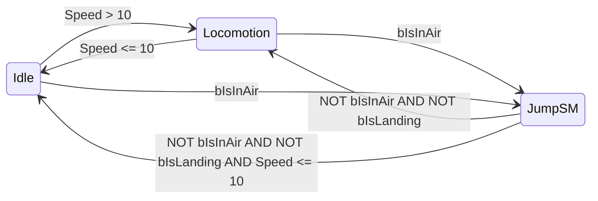

# 17 — Jump System: Guia Blueprint / Editor

> Complemento ao [17_JumpSystem.md](./17_JumpSystem.md). O C++ já expõe variáveis, tags, notifies e tuning — este guia cobre **o que configurar no Unreal Editor** (AnimBP, Data Assets, animações, input).

---

## Pré-requisitos

1. **Recompilar** o módulo `DungeonForged` (Live Coding ou build completo).
2. Confirmar no Content Browser as classes:
   - `AnimNotify_JumpApex`
   - `AnimNotifyState_LandingRecovery`

---

## 1. Personagem — `UDFCharacterMovementComponent`

No **Class Defaults** do herói (`BP_JCHero_Character` ou filho de `ADFPlayerCharacter`):

| Propriedade | Valor sugerido |
|---|---|
| DF Jump Z Velocity | 550 |
| DF Air Control | 0.35 |
| DF Gravity Scale | 1.7 |
| DF Fall Gravity Multiplier | 1.25 |
| DF Jump Stamina Cost | 10 |
| DF Jump Cooldown | 0.20 |
| DF Landing Recovery Window | 0.20 |

> Valores também podem vir de `DA_CombatTuning` (categoria **Jump**) no `BeginPlay` do CMC.

---

## 2. `DA_CombatTuning` — categoria Jump

Abra o Data Asset referenciado em `UDFAssetManager` → **Combat Tuning Data Asset**.

| Campo | Valor sugerido |
|---|---|
| Jump Z Velocity | 550 |
| Jump Air Control | 0.35 |
| Jump Gravity Scale | 1.7 |
| Jump Fall Gravity Multiplier | 1.25 |
| Jump Stamina Cost | 10 |
| Jump Cooldown | 0.20 |
| Jump Landing Recovery Window | 0.20 |

---

## 3. Anim Set — unarmed (`DefaultAnimSet`)

No **AnimBP** do herói (`ABP_JSHeroCharacter`) → **Class Defaults** → **Default Anim Set** → expanda **Jump Set**:

### Unarmed (exploração)

| Slot | Asset (exemplo no projeto) |
|---|---|
| Start Idle | `Jump_Start_0` |
| Start Forward | `Jump_Start_F_0` |
| Start Backward | `Jump_Start_B_180` |
| Start Left | `Jump_Start_L_90` |
| Start Right | `Jump_Start_R_90` |
| Loop | `Jump_Loop_0` |
| Land Idle | `Jump_End_0` |
| Land Forward | `Jump_End_F_0` |
| Land Backward | `Jump_End_B_180` |
| Land Left | `Jump_End_L_90` |
| Land Right | `Jump_End_R_90` |

> Slots legados `Jump Start Anim` / `Jump Loop Anim` / `Jump Land Anim` ainda funcionam como fallback se `Jump Set` estiver vazio.

---

## 4. Anim Set — armed (`DT_Items`)

Para cada arma em `DT_Items`, em **Weapon Anim Set** → **Jump Set**:

| Slot | Asset |
|---|---|
| Start Idle | `Jump_Combat_Start_0` |
| Start Forward | `Jump_Combat_Start_F_0` |
| Start Backward | `Jump_Combat_Start_B_180` |
| Start Left | `Jump_Combat_Start_L_90` |
| Start Right | `Jump_Combat_Start_R_90` |
| Loop | `Jump_Combat_Loop_0` |
| Land Idle | `Jump_Combat_End_0` |
| Land Forward | `Jump_Combat_End_F_0` |
| Land Backward | `Jump_Combat_End_B_180` |
| Land Left | `Jump_Combat_End_L_90` |
| Land Right | `Jump_Combat_End_R_90` |

O C++ já chama `ApplyAnimSet` ao equipar — não é preciso trocar manualmente no AnimBP.

---

## 5. Notifies nas animações

### 5.1 Apex (loop)

1. Abra `Jump_Loop_0` e `Jump_Combat_Loop_0`.
2. No timeline (~50% da duração), adicione **Notify**: `AnimNotify_JumpApex`.
3. (Opcional) No AnimBP, override **Received Notify** ou use um Notify Blueprint para VFX/SFX no pico.

### 5.2 Landing recovery (land)

1. Abra cada `Jump_End_*` e `Jump_Combat_End_*` (10 animações).
2. Nos **últimos ~0,20 s**, adicione **Notify State**: `AnimNotifyState_LandingRecovery`.
3. Isso reforça `State.Landing` e sincroniza com `NotifyLandingRecoveryBegin/End` no AnimInstance.

### 5.3 Footstep (opcional)

No frame de impacto do pé, adicione o footstep notify do projeto (se existir) para som de aterrissagem.

---

## 6. AnimBP — state machine de jump

> **Asset no projeto:** `Content/DungeonForged/Character/JSHero/Animation/BPAnim/ABP_JSHeroCharacter`  
> (a documentação antiga chama `ABP_JCHero` — é o mesmo herói JCHero/JSHero.)  
> **Parent class obrigatória:** `UDFAnimInstance` (ou filho Blueprint).

---

## 6A. `ABP_JSHeroCharacter` — montagem nó a nó

### Passo 0 — Abrir e validar

1. Abre **`ABP_JSHeroCharacter`**.
2. **Class Settings** → **Parent Class** = `UDFAnimInstance` (ou `UDFAnimInstance` BP child).
3. **Class Defaults** → **Default Anim Set** → **Jump Set** (secção 3 deste doc) — faz isto **antes** do AnimGraph.
4. Aba **AnimGraph** → localiza a state machine principal (nome típico: **`LocoSM`**, **`Locomotion`**, ou **`Base`**) na layer **full body**.

Se já existirem estados **`InAir`** / **`Land`** com um único Sequence Player genérico, vais **substituir o conteúdo** por uma sub-máquina `JumpSM` (abaixo). Mantém **Idle** e **Locomotion** como estão.

---

### Passo 1 — Estrutura na `LocoSM` (nível superior)

Objetivo: a locomotion no chão não muda; o ar passa a ser a `JumpSM`.



| Transição | De → Para | Condição | Blend (Crossfade) |
|---|---|---|---|
| T1 | **Idle** → **Locomotion** | `Speed > 10` | 0.20 s |
| T2 | **Locomotion** → **Idle** | `Speed <= 10` | 0.20 s |
| T3 | **Idle** ou **Locomotion** → **JumpSM** | `bIsInAir` **== true** | 0.10 s |
| T4 | **JumpSM** → **Locomotion** | `bIsInAir` **== false** **AND** `bIsLanding` **== false** **AND** `Speed > 10` | 0.15 s |
| T5 | **JumpSM** → **Idle** | `bIsInAir` **== false** **AND** `bIsLanding` **== false** **AND** `Speed <= 10` | 0.15 s |

**Como criar `JumpSM`:**

1. Na `LocoSM`, apaga o estado antigo **`Land`** (a aterrissagem fica dentro de `JumpSM`).
2. Clica no estado **`InAir`** → **Rename** para **`JumpSM`** (ou cria estado novo e apaga o antigo).
3. Seleciona **`JumpSM`** → no **Details** → **State Type** = **State Machine** (não “Single Animation”).
4. **Duplo-clique** em `JumpSM` para entrar na sub-máquina.

---

### Passo 2 — Dentro de `JumpSM` (4 estados)

Cria **quatro estados** (clique direito → **Add State**):

| Estado | Função |
|---|---|
| `JumpStart` | Takeoff direcional (uma vez) |
| `JumpLoop` | Loop no ar |
| `JumpLandBlend` | Pré-blend loop → land |
| `JumpLand` | Montagem de aterrissagem até recovery acabar |

Transições internas:

| De → Para | Condição | Blend |
|---|---|---|
| `JumpStart` → `JumpLoop` | `bIsFalling` **== true** (ou `NOT bIsJumping`) | 0.10 s |
| `JumpLoop` → `JumpLandBlend` | `Get Land Preparation Alpha` **>** `0.15` | 0.20 s |
| `JumpLandBlend` → `JumpLand` | `bIsInAir` **== false** | 0.05 s |
| `JumpLand` → *(saída pela LocoSM)* | *(controlado por T4/T5 acima)* | — |

> **Entrada default** de `JumpSM`: liga **Entry** → `JumpStart`.

---

### Passo 3 — Estado `JumpStart` (grafo interno)

1. **Duplo-clique** em `JumpStart`.
2. No grafo do estado, **clique direito** → **Functions** → **Get Jump Start Anim** (categoria `DF|Locomotion|Jump`).
3. **Clique direito** → **Play Sequence Player** (ou arrasta **Sequence Player**).
4. Liga:
   - **Get Jump Start Anim** (Return Value) → pin **Animation** do **Sequence Player**.
   - **Sequence Player** → **Output Pose** (nó de saída do estado).
5. **Sequence Player** → Details:
   - **Play Rate** = `1.0`
   - **Loop Animation** = **desligado**
   - **Start Position** = `0`

**Transição `JumpStart` → `JumpLoop`:**

1. Arrasta seta de `JumpStart` para `JumpLoop`.
2. Seleciona a seta → **Blend Settings** → Duration = `0.18` (igual a `JumpBlend_StartToLoop`).
3. **Can Enter Transition** → `bTransition_JumpStartToLoop`.

**Transição `JumpLoop` → prep / `Land`:** usa `bTransition_JumpLoopToLandPrep` e `bTransition_JumpLoopToLand`. O C++ exige `JumpLoopPhaseTime` mínimo (default prep `0.18s`, land `0.10s`) para não misturar Start→Loop com land. Recovery em Land: `JumpLandRecoveryMinTime` default `0.35s` (tune no ABP Class Defaults).

---

### Passo 4 — Estado `JumpLoop`

1. **Get Jump Loop Anim** → **Sequence Player** → **Output Pose**.
2. **Sequence Player** → **Loop Animation** = **ligado**.

**Transição → `JumpLandBlend`:**

- Condição: **Get Land Preparation Alpha** `>` `0.15` (cria comparação float).
- Blend: **0.20 s**.

---

### Passo 5 — Estado `JumpLandBlend` (pré-atterrissagem)

Aqui misturas loop com land **antes** do pé tocar o chão.

1. **Get Jump Loop Anim** → **Sequence Player A** (loop ligado).
2. **Get Jump Land Anim** → **Sequence Player B** (loop desligado).
3. **Clique direito** → **Blend Poses by float** (ou **Apply additive** se preferires; para jump usa **Blend Poses by float** full body).
4. Liga:
   - **Sequence Player A** → **Pose A**
   - **Sequence Player B** → **Pose B**
   - **Get Land Preparation Alpha** → **Alpha**
   - Saída do blend → **Output Pose**

**Transição → `JumpLand`:**

- `bIsInAir` **== false**
- Blend **0.05 s** (snap rápido no contacto).

---

### Passo 6 — Estado `JumpLand`

1. **Get Jump Land Anim** → **Sequence Player** → **Output Pose**.
2. **Loop** = desligado.
3. Opcional: **Start Position** = `0` (recomeça a land limpa após o blend).

Não precisas de transição de saída dentro de `JumpSM`: quando `bIsLanding` passa a **false** e `bIsInAir` é **false**, a **LocoSM** (T4/T5) volta a Idle/Locomotion.

---

### Passo 7 — Ligar `JumpSM` na LocoSM

1. Volta um nível (**breadcrumb** `LocoSM` no topo do editor).
2. O pin de saída de **`JumpSM`** deve ligar ao mesmo sítio onde o antigo **InAir** ligava (entrada do grafo principal / próximo blend).
3. Confirma **Entry** da LocoSM: continua em **Idle** (ou o teu default actual).

---

### Passo 8 — Upper body / slots (não mexer no jump)

Se tens **Layered blend per bone** ou **Slot** `UpperBody` **depois** da LocoSM:

- Mantém a ordem: **`LocoSM` (full body, inclui JumpSM)** → depois upper body / montagens de ataque.
- Montagens de melee continuam no slot; o jump é **full body** na base.

---

### Passo 9 — Variáveis de debug no Event Graph (opcional)

No **Event Graph** (não no AnimGraph), podes imprimir no PIE:

- `Print String` ligado a **Event Blueprint Update Animation** (se existir) **não** é necessário — o C++ já atualiza tudo em `NativeUpdateAnimation`.
- Usa antes `df.JumpDebug 2` no console.

---

### Passo 10 — Teste rápido no editor

| Ação | Esperado |
|---|---|
| Parado + Space | `JumpStart` idle → `JumpLoop` → land idle |
| W + Space | `JumpStart` forward |
| S + Space | `JumpStart` backward |
| A / D + Space | left / right |
| Equipar arma | `Jump_Combat_*` (via `ActiveAnimSet`, não precisas mudar o SM) |
| `df.JumpDebug dump` | `Jump J=1` subindo, `F=1` a cair, `L=1` na recovery |

---

### Problemas comuns (AnimBP)

| Sintoma | Correção |
|---|---|
| Sempre `Jump_Start_0` | `Speed` no takeoff < 50 → normal parado; anda antes de saltar para F/B/L/R |
| Land errada (forward em vez de back) | `LastJumpDirection` só é capturada no takeoff — não uses `MovementDirection` na land |
| Preso em `JumpLoop` | Falta transição com `Get Land Preparation Alpha > 0.15` ou threshold muito alto → baixa para `0.1` |
| T-Pose no ar | **Jump Set** vazio no **Default Anim Set** ou parent class não é `UDFAnimInstance` |
| Aterrissa mas não volta à loco | Falta T4/T5 (`NOT bIsInAir` **and** `NOT bIsLanding`) na **LocoSM** |
| Loop não aparece | **Loop Animation** desligado no Sequence Player de `JumpLoop` |

---

### Variante simples (3 estados, menos polish)

Se quiseres validar rápido antes do `JumpLandBlend`:

1. `JumpStart` → `JumpLoop` quando `bIsFalling`.
2. `JumpLoop` → `JumpLand` quando `NOT bIsInAir` (sem pré-blend).
3. Remove `JumpLandBlend`.

Depois adicionas o blend quando o básico estiver estável.

---

### Variáveis (já no C++ `UUDFAnimInstance`)

Use no Event Graph / AnimGraph (somente leitura):

- `bIsInAir`, `bIsJumping`, `bIsFalling`, `bIsLanding`
- `LastJumpDirection` (`EDFMovementDirection`)
- `AirTime`, `VerticalVelocity`, `PredictedLandingDistance`
- `LandPreparationThreshold` (default 250)
- `ActiveAnimSet` → **Break** → `Jump Set`

### Funções Blueprint Pure (C++)

- `Get Jump Start Anim` → sequência de takeoff por direção
- `Get Jump Loop Anim` → loop no ar
- `Get Jump Land Anim` → land por direção do takeoff
- `Get Land Preparation Alpha` → 0..1 para pré-blend antes do chão

### Máquina de estados sugerida

```
[Locomotion Grounded]
        │ bIsInAir
        ▼
[Jump Start]  →  Play: Get Jump Start Anim
        │  (fim da anim OU VerticalVelocity <= 0)
        ▼
[Jump Loop]   →  Play: Get Jump Loop Anim
        │  (Get Land Preparation Alpha > 0)
        ▼
[Jump Land blend] → Loop + Land com alpha = Get Land Preparation Alpha
        │  (NOT bIsInAir)
        ▼
[Landed]      →  Play: Get Jump Land Anim (continua do frame)
        │  (anim end OU bIsLanding == false)
        ▼
[Locomotion Grounded]
```

### Montagem no AnimGraph (exemplo)

**Jump Start / Land (por direção):**

```
Get Jump Start Anim  →  Sequence Player
```

Alternativa sem funções:

```
Break Active Anim Set
  → Jump Set
  → (em BP: switch em LastJumpDirection para o slot correto)
```

**Pré-blend de land:**

```
Layered blend per bone (ou blend por bool)
  Base: Get Jump Loop Anim
  Blend: Get Jump Land Anim
  Alpha: Get Land Preparation Alpha
```

### Transições úteis

| De | Para | Condição |
|---|---|---|
| Grounded | Jump Start | `bIsInAir` && `bIsJumping` |
| Jump Start | Jump Loop | `NOT bIsJumping` OU anim normalized time >= 0.9 |
| Jump Loop | Land blend | `Get Land Preparation Alpha > 0.1` |
| Land blend | Grounded | `NOT bIsInAir` && `NOT bIsLanding` |

---

## 7. Input

Já ligado em `ADFRunPlayerController`:

- `IA_Jump` → `Input_JumpStart` → `Hero->Jump()`
- `Input_JumpEnd` → `StopJumping()`

Verifique no **IMC** do run:

- Teclado: **Space**
- Gamepad: **Face Button Bottom**

---

## 8. Combo — jump-cancel em ataque

Em montagens de melee, mantenha (ou adicione) o notify state:

- `ANS_DFAbilityCancelWindow`

O CDO já inclui `Ability.Movement.Jump` e `Ability.Movement.Dodge`. Durante a janela, `Space` cancela o montage e chama `Jump()` (via `ADFPlayerCharacter::Jump`).

---

## 9. Debug no PIE

Console (`~`):

| Comando | Efeito |
|---|---|
| `df.JumpDebug` | Alterna 0 → 1 → 2 → 3 |
| `df.JumpDebug 1` | Log `[Jump]` no Output Log |
| `df.JumpDebug 2` | Log + HUD compacto (estado) |
| **`df.JumpDebug 3`** | **HUD de transições** (SM rules ON/off + blends sugeridos) |
| `df.JumpDebug trans` | Alias para nível 3 |
| `df.JumpDebug dump` | Dump AnimInstance + CMC + SM |

### HUD de transições (`df.JumpDebug 3`)

Mostra em tempo real:

```
[Jump|SM] Loco>Start=ON  Start>Loop=off Loop>Prep=off Loop>Land=off Land>Loco=off
  J=1 F=0 InAir=1 L=0 | Vz=420 Air=0.05s PredLand=980 Alpha=0.00 (th=0.15)
  Blends: Loco>Start=0.10s Start>Loop=0.12s Loop>Land=0.20s Land>Loco=0.15s
```

Quando uma transição fica **ON**, o log imprime `Transition READY: Loco->JumpStart` (filtro Output Log: `Jump`).

### Variáveis C++ para ligar no AnimBP (recomendado)

Em **Class Defaults** do `ABP_JSHeroCharacter` → categoria **DF | Locomotion | Jump | Transitions**:

| Variável AnimBP | Usar na transição |
|---|---|
| `bTransition Locomotion To Jump Start` | Locomotion → Jump Start |
| `bTransition Jump Start To Loop` | Jump Start → Jump Loop |
| `bTransition Jump Loop To Land` | Jump Loop → Land |
| `bTransition Jump Start To Land` | Jump Start → Land (pulo curto / queda longa) |
| `bTransition Land To Locomotion` | Land → Locomotion |
| **`bTransition Jump Grounded Exit`** | **Jump Loop / Jump Start → Locomotion (escape obrigatório)** |
| `bTransition Jump Loop To Land Prep` | (opcional) Loop → blend pré-land |

**Blend durations** (mesma categoria **Blend**): copia os valores do HUD para o **Duration** de cada seta no SM.

| Transição | Duration sugerida | Mode |
|---|---|---|
| Locomotion → Jump Start | **0.10** | Linear ou Hermite-Cubic InOut |
| Jump Start → Jump Loop | **0.12** | Hermite-Cubic InOut |
| Jump Loop → Land | **0.20** | Hermite-Cubic InOut |
| Land → Locomotion | **0.15** | Hermite-Cubic InOut |

### Correções no teu SM actual (screenshots)

| Problema | Correção |
|---|---|
| Loco→Start usa só `bIsJumping` | OK, mas **`bIsInAir`** é mais fiável no 1.º frame |
| Start→Loop dispara aos **0.08s** ainda a subir | **`Jump Start To Loop Min Air Time`** = **0.20**; regra = **`bTransition Jump Start To Loop`** |
| Logs `Loop->Land` / `Land->Loco` no chão | Corrigido no C++ — flags **sustentadas** durante recovery / chão estável |
| **Preso em Jump Loop no chão (GndExit=off, elapsed alto)** | Falta transição **Jump Loop → Locomotion** com **`bTransition Jump Grounded Exit`** (blend 0.10s). Repete para **Jump Start → Locomotion**. |
| `Land->Loco=ON` mas SM ainda em Jump Loop | A transição Land→Loco só sai do estado **Land** — usa **GndExit** para sair do Loop |
| Start cortado no apex (flicker J/F) | **`bHasPassedJumpApex`** — fase estável; ver `Apex=1` no HUD |
| Loco→Start blend curto demais | **`Jump Blend Loco To Start`** = **0.15**; Start→Loop = **0.18** |

**Regras finais (C++):**

| Transição | Condição |
|---|---|
| Loco → Start | `bTransition Locomotion To Jump Start` (= no ar, antes do apex, `AirTime < StartMax`) |
| Start → Loop | `bTransition Jump Start To Loop` (= apex passou **e** `AirTime >= 0.20`, ou `AirTime >= StartMax`) |
| Loop → Land | `bTransition Jump Loop To Land` (= aterrou; **sem** gate de loopPhase — curto ou longo) |
| Start → Land | `bTransition Jump Start To Land` (= aterrou com `loopPhase < LandMin` **e** SM ainda em Start) |
| Land → Loco | `bTransition Land To Locomotion` (= chão **e** recovery acabou; persiste após timeout do arco) |
| **Loop / Start → Loco (escape)** | **`bTransition Jump Grounded Exit`** (= chão estável ≥ `JumpArcGroundedExitTime`, recovery acabou) |

`Jump Start Max Play Time` default **0.42s** ≈ duração do `Jump_Combat_Start_0` (24 frames @ 60fps).

---
| Loop→Land só `NOT bIsInAir` | Funciona, mas **snap** — adiciona estado **Land Prep** com `Get Land Preparation Alpha > 0.15` |
| Land→Loco **Automatic Rule 0.6s** | **Muito longo** — usa **`bTransition Land To Locomotion`** + Duration **0.15** |
| Blend Land 0.6s | Baixa para **0.15–0.25** |

### Tuning suave

1. `df.JumpDebug 3` no PIE.
2. Salta e observa quando cada linha fica **ON**.
3. Ajusta **Jump Blend \*** no Class Defaults até os blends coincidirem com o timing visual.
4. Se `Loop>Prep` nunca liga, baixa **`Jump Land Prep Alpha Threshold`** (0.10) ou **`Land Preparation Threshold`** (200).

---

## 10. Checklist rápido

- [ ] Parado + Space → `Jump_Start_0`
- [ ] W/A/S/D + Space → start direcional correto
- [ ] Armado → animações `Jump_Combat_*`
- [ ] Land usa **mesma** direção do takeoff (`LastJumpDirection`)
- [ ] Sem stamina (< custo) → pulo negado
- [ ] Durante dodge / landing recovery → pulo bloqueado
- [ ] Durante ataque **sem** cancel window → pulo bloqueado
- [ ] Durante ataque **com** cancel window → montage para + pulo
- [ ] Lock-on mantido; câmera não gira no ar
- [ ] 1 air dodge por pulo
- [ ] `df.JumpDebug 2` mostra HUD

---

## Referência C++

| Sistema | Classe |
|---|---|
| Tuning / stamina / cooldown | `UDFCharacterMovementComponent` |
| Tags GAS | `State.Jumping`, `State.Falling`, `State.Landing` |
| Gate de input | `ADFPlayerCharacter::Jump` |
| Anim vars | `UUDFAnimInstance` |
| Data | `FUDJumpAnimSet` em `FUDAnimSet` |
| Notifies | `UAnimNotify_JumpApex`, `UAnimNotifyState_LandingRecovery` |

Documento completo de arquitetura: [17_JumpSystem.md](./17_JumpSystem.md).
